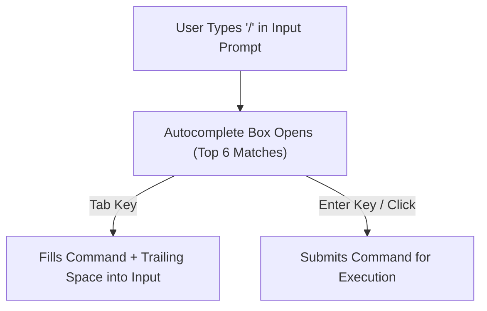

# vitorrent-node: Comprehensive User, Technical & Screen Operations Guide

This manual provides an exhaustive operational reference for `vitorrent-node`. It details system requirements, downloaded dependencies, exact file paths, slash command behaviors, interactive button mechanics, settings configuration, error handling for bad/corrupt inputs, screen layout guides, and keyboard/mouse shortcuts.

---

## 1. System Requirements & Software Stack

### Runtime & System Dependencies
- **Runtime Environment**: Bun v1.3+ (`bun run`). Node.js alone is **incompatible** because `@opentui` relies on native FFI bindings (`opentui.dll` on Windows / `.so` on Linux / `.dylib` on macOS) provided by Bun.
- **Export Condition Requirement**: Bun's module resolution defaults to the `"node"` condition, which loads `solid-js/dist/server.js` (a non-reactive SSR build). `vitorrent-node` automatically enforces `--conditions=browser` via a self-relaunch guard in `src/index.tsx`.
- **Supported Operating Systems**: Windows (x64), Linux (x64), macOS (x64 / arm64).

### Project Dependencies Manifest (`package.json`)
- `@opentui/core` (`^0.1.53`): Core terminal rendering library, layout engine, native FFI layer.
- `@opentui/solid` (`^0.1.53`): Custom SolidJS renderer for OpenTUI terminal nodes.
- The platform's `@opentui/core-*` native binary (`opentui.dll` / `libopentui.so` / `.dylib`), resolved automatically by `@opentui/core` from its own `optionalDependencies`, **not** a direct dependency here, so the package installs on every platform.
- `solid-js` (`^1.9.5`): Fine-grained reactive signal framework.
- `webtorrent` (`^3.0.21`): BitTorrent protocol engine, peer wire protocol, tracker/DHT discovery.

---

## 2. On-Disk State & Configuration File Paths

All user configuration, session metadata, logs, and cached files are stored under the state directory (default: `~/.vi-torrent/`):

| Target Resource | Absolute File Path | Description & Purpose |
| :--- | :--- | :--- |
| **Session Metadata Index** | `~/.vi-torrent/session.json` | Stores array of persisted torrents (`infoHash`, `magnetURI`, `savePath`, `name`, `length`, `background`, `skipped`). |
| **Settings File** | `~/.vi-torrent/settings.json` | JSON configuration file holding all persistent app settings. |
| **Cached `.torrent` Files** | `~/.vi-torrent/torrents/<infoHash>.torrent` | Raw bencoded `.torrent` file byte cache for immediate offline hash verification on startup. |
| **Default Download Directory**| `~/Downloads/vi-torrent/` | Default save path where downloaded files land. |
| **Daemon Execution File** | `~/.vi-torrent/daemon.json` | Background daemon lock file containing `{ pid, port, token, startedAt }`. |
| **Daemon 1s Status File** | `~/.vi-torrent/daemon-status.json` | Live JSON snapshot rewritten every 1 second by background daemon. |
| **Daemon Log File** | `~/.vi-torrent/daemon.log` | Append-only text log file for background process diagnostics. |

---

## 3. Slash Commands Technical Reference

Slash commands can be triggered by typing `/` into the bottom input prompt bar.



### Slash Command Matrix

| Slash Command | Argument Syntax | Category | Trigger / Action | Expected Input Format | Error Handling for Bad/Wrong Inputs |
| :--- | :--- | :--- | :--- | :--- | :--- |
| `/add-magnet` | `<uri>` | Torrents | Adds torrent from magnet link | Must start with `magnet:?` containing `xt=urn:btih:` or `btmh:` | • Empty URI: `"Missing magnet URI"`<br/>• Non-magnet string: `"Not a magnet link (expected magnet:?xt=urn:btih:...)"` |
| `/add-file` | `<path>` | Torrents | Adds torrent from `.torrent` file | Path to valid `.torrent` bencoded file | • File not found: `"File not found: <path>"`<br/>• Directory path passed: `"That is a folder, not a .torrent file"`<br/>• HTML response page passed (e.g. 404 page): `"Not a .torrent file (looks like HTML - a failed download?): <path>"`<br/>• Corrupt binary file: `"Not a valid .torrent file (bad bencode header): <path>"` |
| `/pause` | `[id]` | Torrents | Pauses selected (or specified ID) torrent | Integer ID (optional, defaults to selected row) | • No selection & no ID: `"No torrent selected"`<br/>• Non-existent ID: `"No torrent with id <id>"`<br/>• Non-numeric string: `"Invalid torrent id"` |
| `/resume` | `[id]` | Torrents | Resumes selected (or specified ID) torrent | Integer ID (optional, defaults to selected row) | Same validation as `/pause`. Triggers tracker & DHT re-announce. |
| `/remove` | `[id]` | Torrents | Removes selected (or specified ID) torrent from session (keeps files) | Integer ID (optional, defaults to selected row) | Same validation as `/pause`. |
| `/details` | *None* | Torrents | Opens per-torrent file and peer details modal overlay | *None* | • No torrent selected: `"No torrent selected"` |
| `/theme` | `[name]` | Appearance | Changes UI theme palette or opens settings theme picker | Theme name (`claude`, `nord`, `gruvbox`, `dracula`, `matrix`, `tokyo`, `catppuccin`, `solarized`, `light`, `darkplus`, `neon`, `mono`) | • Unknown theme name: `"Unknown theme: <name> (try claude, nord, gruvbox, dracula, matrix, tokyo, catppuccin, solarized, light, darkplus, neon, mono)"`<br/>• Empty arg: Opens Settings modal focused on `theme` row. |
| `/settings` | *None* | System | Opens application settings modal overlay | *None* | *None* |
| `/quit` (or `/exit`) | *None* | System | Restores terminal buffer, hands off background torrents, exits process | *None* | *None* |

---

## 4. Interactive Action Buttons Guide

The top control strip features 9 interactive button chips. Buttons are borderless and 1 row tall to save terminal space. Hovering fills the background with `theme.accent`.

| Button Label | Action Triggered | Disabled State Criteria | Behavior & Safety Confirmations |
| :--- | :--- | :--- | :--- |
| **`Pause`** | Pauses selected torrent | Disabled when no row selected | Sends pause command to engine or daemon. |
| **`Resume`** | Resumes selected torrent | Disabled when no row selected | Sends resume command and triggers tracker/DHT re-announce. |
| **`Remove`** | Removes selected torrent | Disabled when no row selected | Removes torrent from session list (keeps files on disk). |
| **`Remove + Files`** | Destroys torrent and deletes files & folder from disk | Disabled when no row selected | **2-Click Safety Guard**: First click arms button, changing label to bright red `Click again to delete`. Moving selection disarms confirm. Second click deletes files and folder. |
| **`[x] Background`** / **`[ ] Background`** | Toggles background download flag | Disabled when no row selected | Ticking hands torrent over to detached daemon (`daemon.ts`). Unticking reclaims torrent to local TUI process paused. |
| **`Stop background`** | Stops background daemon | Disabled when `remoteCount === 0` (no background downloads) | Unticks all background torrents, causing daemon to exit. |
| **`Details`** | Opens `/details` modal overlay | Disabled when no row selected | Displays per-torrent file list and connected peer swarm. |
| **`Settings`** | Opens `/settings` modal overlay | Always enabled | Opens global configuration modal overlay. |
| **`Quit`** | Restores terminal & exits app | Always enabled | Hands off background torrents, halts render loop, writes ANSI restore codes (`\x1b[?1049l`, `\x1b[?25h`), exits process. |

---

## 5. AppSettings & Configuration Guide

Settings are modified in the `/settings` overlay modal using arrow keys (stepping ladders) rather than free-text entry to prevent invalid values.

| Setting Name | Default Value | Technical Meaning | Stepping Ladder / Range | Relaunch Required? |
| :--- | :--- | :--- | :--- | :--- |
| **`Theme`** | `"claude"` | Active color palette | Cycles `claude` ↔ `nord` ↔ `gruvbox` ↔ `dracula` ↔ `matrix` ↔ `tokyo` ↔ `catppuccin` ↔ `solarized` ↔ `light` ↔ `darkplus` ↔ `neon` ↔ `mono`. **Live preview applied immediately!** | Live (No) |
| **`Download limit`**| `0` (unlimited) | Max download speed cap in bytes/sec | `0` → `50 KB/s` → `100 KB/s` → `250 KB/s` → `500 KB/s` → `1 MB/s` → `2 MB/s` → `5 MB/s` → `10 MB/s` | Live (No) |
| **`Upload limit`** | `0` (unlimited) | Max upload speed cap in bytes/sec | Same speed ladder as download limit. | Live (No) |
| **`Max connections`**| `55` | Global peer connection cap | Steps by 5 between 5 and 500. | Live (No) |
| **`Sequential`** | `false` | Download pieces in order for streaming | Toggles `on` / `off`. | Applies to new torrents |
| **`Seed ratio limit`**| `0` (never) | Auto-pause after giving back ratio | Steps by `0.5` between `0` (never stop) and `10.0`. | Live (No) |
| **`DHT`** | `true` | Mainline DHT peer discovery | Toggles `on` / `off`. | Marked `(next launch)` |
| **`Peer exchange`** | `true` | PEX (ut_pex) peer discovery | Toggles `on` / `off`. | Marked `(next launch)` |
| **`Local discovery`**| `true` | LSD (mDNS) LAN peer discovery | Toggles `on` / `off`. | Marked `(next launch)` |
| **`Encryption`** | `1` (prefer) | Peer wire protocol encryption | `0` (off) ↔ `1` (prefer) ↔ `2` (require). | Marked `(next launch)` |
| **`Listen port`** | `0` (random) | Port for incoming peer connections | Ladder: `0` (random) → `6881` → `6882` → `6889` → `6969` → `51413`. Any other port must be set in `settings.json`. The panel has no text entry, so a +1 stepper would put an arbitrary port tens of thousands of key presses away. | Marked `(next launch)` |
| **`Port forwarding`**| `true` | Router UPnP / NAT-PMP port mapping | Toggles `on` / `off`. | Marked `(next launch)` |

---

## 6. Visual Screen Guide & Interactive Layout Map

```
┌────────────────────────────────────────────────────────────────────────────────────────┐
│  vi-torrent (ASCII Logo Banner)                                                          │
│  BitTorrent client · tick BG to download in the background, even after you close       │
├────────────────────────────────────────────────────────────────────────────────────────┤
│ [Pause] [Resume] [Remove] [Remove + Files] [[x] Background] [Details] [Settings] [Quit]│
├────────────────────────────────────────────────────────────────────────────────────────┤
│ SEL │ BG  │ ID │ Name                     │ Size    │ Progress          │ Down │ Up  │ Ratio│ Status      │
│─────┼─────┼────┼──────────────────────────┼─────────┼───────────────────┼──────┼─────┼──────┼─────────────│
│ (o) │ [x] │ 0  │ ubuntu-26.04-desktop.iso │ 6.07 GB │ ▐████░░░░▌  41.2% │ 7.35MB/s│- │ 0.15 │ Background  │
│ ( ) │ [ ] │ 1  │ archlinux-x86_64.iso     │ 938 MB  │ ▐████████▌ 100.0% │ -    │ -   │ 1.42 │ Done        │
├────────────────────────────────────────────────────────────────────────────────────────┤
│ ❯ /add-file                                                                            │
│ ┌────────────────────────────────────────────────────────────────────────────────────┐ │
│ │ ❯ /add-file <path>        Add a torrent from a .torrent file                       │ │
│ │   /add-magnet <uri>       Add a torrent from a magnet link                         │ │
│ └────────────────────────────────────────────────────────────────────────────────────┘ │
└────────────────────────────────────────────────────────────────────────────────────────┘
```

### Keyboard Navigation & Shortcuts Map

| Context / Location | Shortcut Key | Triggered Action |
| :--- | :--- | :--- |
| **Global** | `Ctrl + C` | Hands off background torrents, restores terminal, exits app. |
| **Torrent Table** | `Up` / `Down` | Moves table selection row up or down. Disarms pending delete confirm. |
| **Torrent Table** | Mouse Click | Clicking any row in table selects that row directly (`selectRowAt`). |
| **Input Bar** | `/` | Opens slash command autocomplete overlay window. |
| **Autocomplete Overlay** | `Up` / `Down` | Navigates through matching slash command suggestions list. |
| **Autocomplete Overlay** | `Tab` | Fills highlighted suggestion into input prompt (with trailing space). |
| **Autocomplete Overlay** | `Enter` / Click | Executes highlighted suggestion directly. |
| **Settings Overlay** | `Up` / `Down` | Moves cursor between settings fields. |
| **Settings Overlay** | `Left` / `Right` | Steps setting value (cycles theme, steps speed ladder). **Theme changes live!** |
| **Settings Overlay** | `Enter` | Saves updated settings to `settings.json` and closes modal. |
| **Settings Overlay** | `Escape` | Cancels draft settings and **restores original theme**. |
| **Detail Overlay** | `Up` / `Down` | Moves cursor through torrent file list. |
| **Detail Overlay** | `Space` / `Left` / `Right` | Toggles file inclusion/skipping (`[x]` ↔ `[ ]`). A skipped file may still receive a little data. Pieces span file boundaries, so its edge pieces arrive when a neighbouring wanted file needs them. |
| **Detail Overlay** | `Escape` | Closes details modal overlay. |
