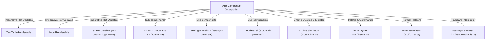

# Component Spec: `src/app.tsx`

**File Path:** [src/app.tsx](../src/app.tsx)  
**Role:** Primary TUI shell component, UI composition, torrent table formatting, slash command dispatcher, button row controller, and terminal teardown manager.

---

## 1. Functional Specification

`src/app.tsx` forms the core user interface of `vitorrent-node`:
1. **Header & Logo Section**: Displays an adaptive ASCII block-letter logo (`vi-torrent`), header status line (showing live background downloads count & daemon PID, or session re-attach info).
2. **Top Action Button Row**: Renders 9 compact, borderless button chips:
   - `Pause`: Pauses selected torrent.
   - `Resume`: Resumes selected torrent (triggers tracker & DHT re-announce).
   - `Remove`: Removes torrent from list (keeps files on disk).
   - `Remove + Files`: 2-click safety button (arms on first click turning red to `Click again to delete`, removes files and folder on second click).
   - `[x] Background`: **Opens the [Background dialog](doc_src_bg_panel_tsx.md)**. It no longer acts on click. The checkbox there only changes the screen; Save applies, Cancel discards. **Disabled while the torrent is actually changing hands**. During that window the row reads `Starting...`, the torrent belongs to neither the TUI nor the daemon, and the button reads `... handing over`. Deliberately *not* disabled for the whole time BG is on: `Stop background` releases every background torrent, so that would mean stopping five downloads to reclaim one. See [the handover window](doc_src_engine_ts.md#the-handover-window).
   - `Stop background`: Unticks all background torrents and halts background daemon. Stays enabled during a handover, for the same reason, and `tests/test-bg-button-state.tsx` proves it is safe there.
   - `Details`: Opens per-torrent file and peer details modal (`/details`).
   - `Settings`: Opens global configuration modal (`/settings`).
   - `Quit`: Gracefully stops render loop, releases background torrents, restores terminal buffer, and exits.
3. **Torrent Data Table**: Formats torrent items into columns (`SEL`, `BG`, `ID`, `Name`, `Size`, `Progress`, `Down`, `Up`, `Ratio`, `Status`).
   - `SEL`: a **checkbox** - `[x]` when ticked for a bulk action, `[ ]` otherwise. Nothing is ticked on launch, so the app never arrives with an action armed. The **cursor** is a separate thing, shown by the accent-coloured name rather than a second marker in this column; actions apply to the ticked rows, or to the cursor row when nothing is ticked. See [doc_multiselect.md](doc_multiselect.md).
   - `Progress`: Multi-chunk custom progress bar with green fill (`▐████░░░░▌ 40.0%`).
   - **Row washes**: a `Done` row takes a faint tint of `success` (16% over the background), a `Failed` row a faint tint of `error` (18%), the way a diff marks added and removed lines. Deliberately faint, and applied to every chunk in the row including the bar; a saturated background is what made the old full-row selection highlight swallow the progress bar.
   - **Secondary text uses `dimText()`**, not `theme.muted`. Measured against their own backgrounds, ten of eleven palettes had `muted` under the 4.5:1 WCAG AA threshold (tokyo worst at 2.76:1), so dim text was genuinely hard to read. `theme.muted` is still correct for things only *perceived*: an unticked checkbox, the hollow half of a bar.
   - **Every column carries a role colour**, not just the header: status by state (accent downloading, success done, warning background, muted paused), down/up speeds green/amber while moving and muted while idle, ids and sizes muted, ratio muted until something has been shared. The table previously used only two colours and read as monochrome in every theme.
   - Mouse click handler (`onMouseDown`) maps screen Y coordinates to a row: the click moves the cursor there **and** toggles its tick. Arrow keys move the cursor without ticking.
4. **Slash Command Bar & Autocomplete Overlay**:
   - Responds to `/` input with a scrolling list of matching commands (windowed to `MAX_SUGGESTIONS = 6`).
   - Supports arrow navigation, `Tab` auto-completion, mouse click selection, and Enter execution.
   - Exact-match verification prevents argument-less commands (like `/quit`) from getting trapped in auto-completion loops.
5. **Key Interception & Routing**: Intercepts keys on the `<input />` element via `interceptKeyPress()` to route `Up`, `Down`, `Left`, `Right`, `Return`, `Tab`, `Escape`, and `Ctrl+C` to modals or table selection.

---

## 2. Technical Specification & Implementation Details

### Terminal Teardown & Restitution Procedure

```typescript
const shutdown = (): void => {
  let handedOff = false;
  try { handedOff = engine.handoffToBackground(); } catch {}
  try { engine.destroy(); } catch {}
  try { renderer.stop(); } catch {}
  try { renderer.destroy(); } catch {}
  process.stdout.write(
    "\x1b[?1049l" + // leave alternate screen buffer
    "\x1b[?25h" +   // show cursor
    "\x1b[?1000l\x1b[?1002l\x1b[?1003l\x1b[?1006l" + // disable mouse reporting
    "\x1b[0m"       // reset attributes
  );
  setTimeout(() => process.exit(0), handedOff ? 400 : 30);
};
```
- **Rationale**: `renderer.destroy()` defers cleanup when called during a render. Halting `renderer.stop()` first and explicitly emitting ANSI escape sequences guarantees the terminal restores properly without leaving ghost frames on screen.

### Table Content Formatting Chunk Architecture

```typescript
function formatTorrentTableContent(torrents: TorrentItem[], selectedIndex: number): TextTableContent {
  const headerRow = TABLE_HEADERS.map(label => [{
    __isChunk: true as const,
    text: label,
    fg: parseColor(theme.accent),
    attributes: createTextAttributes({ bold: true }),
  }]);
  // ... maps torrent rows into multi-chunk cells with per-chunk colors
}
```

---

## 3. Component Connections & State Flow



---

## 4. Input & Output Structure

- **Inputs**: User keyboard events, mouse click coordinates, engine state changes (1s refresh timer).
- **Outputs**: Rendered TUI frame, terminal stdout stream, Engine method calls.

---

## Animated header

`paintHeader()` runs on a 120ms interval (separate from the 1s data refresh,
which is far too slow for animation) and redraws two things:

1. **The logo**, as a `TextRenderable` built from `src/logo.ts` - one
   `TextChunk` per column, assigned as a `StyledText`. It is deliberately not
   an `<ascii_font>`: that renderable's colour array is indexed by the font's
   own segment (fill/outline) rather than by position, so it cannot express a
   travelling wave. The band blends `theme.background → theme.accent`.
2. **The avatar**, from `src/avatar.ts` - running (legs + hop) whenever any
   torrent is `Downloading` or `Background`, idle (blink + weight shift)
   otherwise, tinted `theme.progress` or `theme.muted`.

**Live mode is required.** The renderer paints on demand by default, so the
animation would advance in memory while the terminal stayed frozen.
`renderer.requestLive()` is called at startup and `dropLive()` in `onCleanup`.

**Reactivity trap**: `paintHeader()` reads `engine.getTorrents()` directly and
NOT the `torrents()` signal. It is invoked from an effect that also calls
`updateTorrents()`, which writes that signal - reading it here made the effect
depend on its own output and it re-entered until the stack overflowed.

## The header must not outlive what it describes

The hint line under the logo reports one of three things: background downloads
in progress, torrents reattached from the last session, or the plain tagline.

The middle one used to lie. `restoredCount` was captured once at launch:

```ts
const restoredCount = engine.restore();          // never changes again
...
} else if (restoredCount > 0) {
  hintTextRef.content = `Reattached ${restoredCount} torrent...`;
```

So the notice survived everything it described: the torrents being resumed,
being removed, the table emptying entirely. Reported with a screenshot of an
empty table under *"Reattached 1 torrent from your last session · paused,
click Resume to continue"*.

The engine now records **which** torrents it restored
(`getRestoredHashes()`), and the effect counts the ones still listed **and**
still paused, reading the live `torrents()` signal so it re-evaluates on every
refresh. The notice retires itself.

**No refresh button.** The suggestion was reasonable, the screen was showing
old information, but the data was never stale. The table already rebuilds
every second; exactly one string was frozen. A button would have hidden the
bug behind a manual step and left the wrong text on screen until it was
clicked.

## Responsive layout

A terminal can be any size, and the layout used to assume a generous one. When
the content was taller than the window, the boxes were laid out past the
bottom and painted over each other: at 100x10 the logo glyphs bled through the
hint line and the table borders ran straight through the prompt.

Three mechanisms, in `applyResponsiveLayout()` (called from `paintHeader()`,
so it runs on the animation tick and on `resize`) and in the JSX:

1. **The header is dropped under 20 rows.** `headerBoxRef.visible = false` -
   opentui maps `visible` onto yoga's `display:none`, so a hidden box stops
   taking up space rather than merely not painting. The logo and avatar are
   the only decoration; the table and the prompt are the app.
2. **The button row wraps** (`flexWrap="wrap"`). With nine buttons and no
   wrap, a narrow terminal simply cut the row off and Details, Settings and
   Quit became unreachable.
3. **The table lives in a `<scrollbox>`, not a `<box>`.** Hiding the header
   buys back a few rows, but a torrent list has no upper bound - five torrents
   in a 14-row terminal painted the table through the prompt. The scrollbox
   clips to the space left over and scrolls with the wheel.

`ScrollBoxRenderable` is **focusable by default**, which stole focus from the
command input the moment a row was clicked; everything typed afterwards went
nowhere. It is set non-focusable in its ref.

**The table is the only element allowed to shrink.** It can scroll; the others
just vanish. The suggestion list, the error line and the prompt row therefore
carry `flexShrink={0}` - without it they shrank in proportion with the table
and half the command list disappeared.

Covered by `tests/test-layout.tsx`, which resizes a live renderer through
120x30, 100x10, 60x18, 45x12 and back. Its assertions require the prompt to be
**present and unpolluted** in one check: overflow shows up either as painting
over the prompt or as pushing it off the screen, and an earlier version that
only checked for stray box-drawing characters passed happily against a prompt
that was not there at all.
