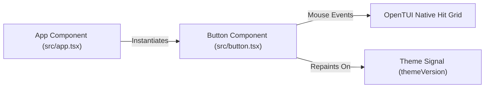

# Component Spec: `src/button.tsx`

**File Path:** [src/button.tsx](../src/button.tsx)  
**Role:** Borderless single-row clickable button chip component, hover effect manager, disabled state renderer, danger tone armed warning button, and imperative ref updater.

---

## 1. Functional Specification

`src/button.tsx` provides the top control bar's interactive button chips:
1. **Vertical Space Efficiency**: Deliberately borderless and 1 row tall (`height={1}`). Standard bordered boxes take 3 vertical rows, which is too expensive for a control strip in terminal interfaces.
2. **Hover & Active Highlighting**:
   - In terminal TUIs, "smaller" fonts do not exist (every character cell is equal size).
   - Hover is visually indicated by filling the background cell (`boxRef.backgroundColor = fill`) instead of recoloring a border.
3. **Mouse Click Event Handling**: OpenTUI lacks a dedicated `click` event; `onMouseDown` acts as press event. Hit testing is native and automatic, bubbling up from inner `<text>` to parent `<box>`.
4. **Tone & Danger State Support**:
   - `tone: () => "normal" | "danger"`.
   - Used by the 2-click delete confirmation (`Remove + Files` -> `Click again to delete`). Armed danger state paints text in bright red (`theme.error`).
5. **Imperative Ref Updating**: Label text, foreground color, and background fill are applied imperatively inside `createEffect` via `textRef` and `boxRef` rather than dynamic JSX props, matching the project's reactivity model.

---

## 2. Technical Specification & Implementation Details

### Imperative Ref Update Architecture

```typescript
export function Button(props: ButtonProps) {
  const [hovered, setHovered] = createSignal(false);
  let boxRef: BoxRenderable | undefined;
  let textRef: TextRenderable | undefined;

  createEffect(() => {
    themeVersion(); // repaint when palette changes
    const isDisabled = props.disabled?.() ?? false;
    const isDanger = (props.tone?.() ?? "normal") === "danger";
    const isHovered = hovered();

    const active = isHovered && !isDisabled;
    const fill = active ? (isDanger ? theme.error : theme.accent) : theme.background;
    const color = active
      ? theme.selectionFg
      : isDisabled
        ? theme.muted
        : isDanger
          ? theme.error
          : theme.text;

    if (textRef) {
      textRef.content = props.label();
      textRef.fg = color;
      textRef.bg = fill;
    }
    if (boxRef) boxRef.backgroundColor = fill;
  });
  // ... returns JSX <box><text /></box>
}
```

---

## 3. Relationship & Component Connections



---

## 4. Input & Output Structure

- **Inputs**: `ButtonProps` (`label()`, `onPress()`, `disabled()`, `tone()`).
- **Outputs**: Rendered 1-row `<box>` element with `<text>` node, mouse interaction handlers (`onMouseDown`, `onMouseOver`, `onMouseOut`).
