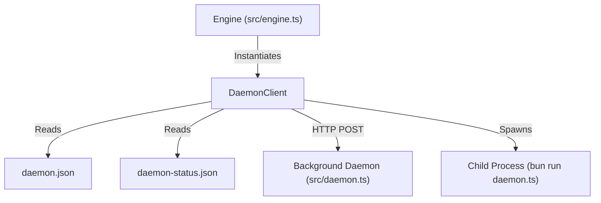

# Component Spec: `src/daemon-client.ts`

**File Path:** [src/daemon-client.ts](../src/daemon-client.ts)  
**Role:** TUI-side client interface for communicating with the background downloader daemon, status reader, HTTP IPC proxy, and process spawner.

---

## 1. Functional Specification

`src/daemon-client.ts` enables the main TUI process to interact seamlessly with the detached background daemon:
1. **Synchronous Status Reader**: `torrents()` reads `daemon-status.json` synchronously from disk.
   - **Stale Detection**: If `Date.now() - status.updatedAt > 8000ms`, the snapshot is treated as stale (indicating the daemon crashed or hung) and returns `[]`.
2. **Liveness Verification**: `isRunning()` and `pid()` verify daemon health by checking if `daemon.json` exists and sending signal 0 (`process.kill(pid, 0)`).
3. **Asynchronous HTTP IPC Proxy**: Wraps `fetch()` requests to `http://127.0.0.1:<port>` with `x-vi-torrent-token` authorization header:
   - `add(infoHash)`
   - `pause(infoHash)`
   - `resume(infoHash)`
   - `remove(infoHash, deleteFiles)`
   - `shutdown()`
4. **Detached Process Spawner**: `spawnDetached(daemonScript)` spawns `bun run src/daemon.ts --state <stateDir>` with `{ detached: true, stdio: "ignore", windowsHide: true }` and calls `child.unref()`, allowing the background daemon to survive parent TUI closure.

---

## 2. Technical Specification & Implementation Details

### Detached Process Spawning

```typescript
spawnDetached(daemonScript: string): void {
  const child = spawn(process.execPath, ["run", daemonScript, "--state", this.stateDir], {
    detached: true,
    stdio: "ignore",
    windowsHide: true,
  });
  child.unref();
}
```
- **Windows Portability**: `windowsHide: true` prevents a command prompt console window from flashing on screen when backgrounding.

---

## 3. Relationship & Component Connections



---

## 4. Input & Output Structure

- **Inputs**: `stateDir` path, `infoHash` strings, `deleteFiles` booleans.
- **Outputs**: `DaemonTorrent[]` arrays, liveness booleans, IPC operation Promises.
