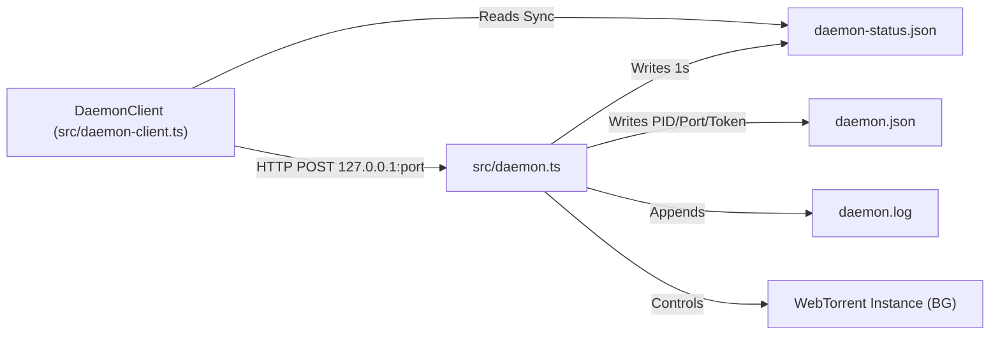

# Component Spec: `src/daemon.ts`

**File Path:** [src/daemon.ts](../src/daemon.ts)  
**Role:** Detached background downloader process, status file serializer, HTTP IPC control server, and autonomous idle downloader.

---

## 1. Functional Specification

`src/daemon.ts` is an autonomous background process spawned by the main TUI when torrents are flagged with `[x] Background`:
1. **Single-Instance Enforcement**: Reads `~/.vi-torrent/daemon.json` on startup. If another daemon process PID is alive (`process.kill(pid, 0)`), the process logs a message and exits immediately to prevent dual-writer file corruption.
2. **Synchronous Status Channel**: Every 1 second, it serializes a snapshot of all active background torrents (`infoHash`, `name`, `length`, `progress`, `downloadSpeed`, `uploadSpeed`, `paused`, `done`, `peers`, `ratio`) into `~/.vi-torrent/daemon-status.json`.
3. **Asynchronous HTTP Control IPC Channel**:
   - Binds an HTTP server to `127.0.0.1` on a random free port.
   - Generates a 24-byte cryptographically secure random token (`crypto.randomBytes(24).toString("hex")`).
   - Requires `x-vi-torrent-token` header on all incoming HTTP POST requests.
   - Endpoints:
     - `POST /status`: Returns current snapshot JSON.
     - `POST /add`: Re-reads `session.json` and adds specified torrent.
     - `POST /pause`: Pauses specified torrent.
     - `POST /resume`: Resumes specified torrent and triggers `rediscover(t)`.
     - `POST /remove`: Destroys torrent, deletes files/folder if `deleteFiles: true`.
     - `POST /shutdown`: Gracefully shuts down WebTorrent, unlinks status/daemon files, and exits process.
4. **Autonomous Idle Teardown**: If `client.torrents.length === 0` (e.g. all background torrents are unticked or removed), the daemon cleans up its files and exits immediately (`shutdown(0)`).
5. **Honours the user's file selection**: re-applies `skipped` from the session index on `metadata`, and reports progress via `selectedProgress()`, see below.

---

## The daemon must respect skipped files

It did not. `session.json` has carried a `skipped` array per torrent all
along, and **the daemon never read it**. Two consequences, both invisible
because a background download is invisible by nature:

1. It **downloaded files the user had explicitly unticked** in the TUI. The
   selection was persisted correctly; the daemon simply ignored it.
2. Its reported progress used WebTorrent's whole-torrent definition, so a
   ticked torrent with skips never reached 100% and never showed `Done`,
   the same bug the foreground had, arrived at independently.

Both are fixed in the same place. On add, the skips are recorded in
`skippedByHash` and applied to the torrent's files once metadata arrives
(deselecting before then is impossible: there is no file list yet).
`snapshot()` then runs the same `selectedProgress()` correction the TUI uses,
so a torrent reads identically whichever process owns it.

That last property is the point: ownership moves back and forth as the user
ticks and unticks BG, and progress jumping when it changes hands would look
exactly like data loss.

---

## 2. Technical Specification & Implementation Details

### HTTP IPC Server Setup

```typescript
const token = crypto.randomBytes(24).toString("hex");

const server = http.createServer((req, res) => {
  if (req.headers["x-vi-torrent-token"] !== token) {
    return reply(403, { error: "forbidden" });
  }
  // Handles endpoints: /status, /add, /pause, /resume, /remove, /shutdown
});
```

### Snapshot Serialization Schema

```json
{
  "pid": 19620,
  "updatedAt": 1785361234000,
  "torrents": [
    {
      "infoHash": "a1b2c3...",
      "name": "ubuntu-26.04.iso",
      "length": 6516980000,
      "progress": 0.412,
      "downloadSpeed": 7350000,
      "uploadSpeed": 12000,
      "paused": false,
      "done": false,
      "peers": 42,
      "ratio": 0.15
    }
  ]
}
```

---

## 3. Relationship & Component Connections



---

## 4. Input & Output Structure

- **CLI Options**: `--state <stateDir>`
- **Inputs**: HTTP POST payloads (`/add`, `/pause`, `/resume`, `/remove`, `/shutdown`), `session.json`, `torrents/*.torrent`.
- **Outputs**: `daemon.json`, `daemon-status.json`, `daemon.log`, HTTP JSON responses.
