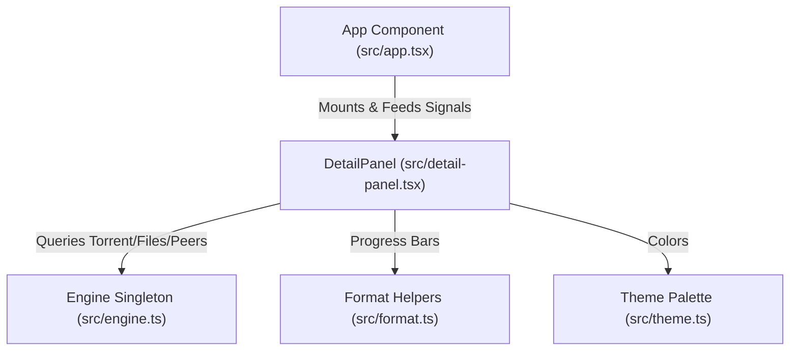

# Component Spec: `src/detail-panel.tsx`

**File Path:** [src/detail-panel.tsx](../src/detail-panel.tsx)  
**Role:** Per-torrent details modal overlay (`/details`), file selection/skipping controller, live peer list visualizer, and live progress synchronization.

---

## 1. Functional Specification

`src/detail-panel.tsx` provides detailed insight into individual torrent contents and peer swarms:
1. **Modal Visibility State**: Signal-backed toggle `isDetailOpen()` controlled via `setIsDetailOpen()`.
2. **File List Inspector**:
   - Displays all files contained within the selected torrent (`FileItem[]`).
   - Renders file index cursor (`❯`), checkbox state (`[x]` wanted, `[ ]` skipped), filename (truncated to 46 characters), formatted byte size, custom progress bar (`progressBar(file.progressRatio, 8)`), and percentage string.
   - **File Toggling**: Pressing `Space`, `Left`, or `Right` toggles inclusion/skipping via `props.onToggleFile(fileIndex)`. Displays error message if attempting to deselect all files.
   - **Caveat**: A skipped file may still receive a small amount of data. Pieces span file boundaries, so the edge pieces of a skipped file are fetched when an adjacent wanted file needs them.
3. **Live Peer List Visualizer**:
   - Lists connected peer connections (`PeerItem[]`) showing IP:Port, wire transport type (`tcp`, `webSeed`), download speed, and upload speed.
   - **Row Capping**: Caps displayed peers to 8 items (e.g. `+ N more`) to prevent peer list explosion from pushing the file list off screen.
4. **Live Synchronization**: Re-renders contents on every 1-second refresh tick (`props.tick()`) to show real-time piece downloading progress and live peer throughput.

---

## 2. Technical Specification & Implementation Details

### Imperative Ref Construction

```typescript
createEffect(() => {
  themeVersion();
  props.tick(); // repaint on refresh tick for live progress
  if (!isDetailOpen()) return;
  // Formats file list & peer list text blocks imperatively
  bodyRef.content = lines.join("\n");
});
```

---

## 3. Relationship & Component Connections



---

## 4. Input & Output Structure

- **Inputs**: `torrent()` getter, `files()` getter, `peers()` getter, `onToggleFile(index)` callback, `tick()` refresh signal.
- **Outputs**: Rendered details modal frame, updated file inclusion preferences saved to `session.json`.
