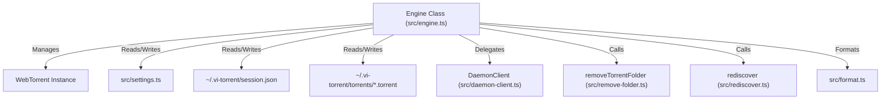

# Component Spec: `src/engine.ts`

**File Path:** [src/engine.ts](../src/engine.ts)  
**Role:** Central BitTorrent engine controller, WebTorrent instance manager, session index persistence engine, torrent lifecycle manager, background downloader bridge, and file priority coordinator.

---

## 1. Functional Specification

`src/engine.ts` acts as the primary data and protocol controller for `vitorrent-node`:
1. **WebTorrent Lifecycle Management**: Wraps `webtorrent` v3.0.21, configuring client options (`maxConns`, `dht`, `pex`, `lsd`, `secure`, `torrentPort`, `downloadLimit`, `uploadLimit`).
2. **Session Persistence Engine**:
   - Maintains `~/.vi-torrent/session.json` containing `PersistedTorrent` metadata (`infoHash`, `magnetURI`, `savePath`, `name`, `length`, `background`, `skipped`).
   - Caches raw `.torrent` file bytes in `~/.vi-torrent/torrents/<infoHash>.torrent` to allow offline hash re-verification on launch without waiting for tracker metadata.
   - Restores all previous session torrents in `paused` state upon launch (`restore()`).
3. **Background Downloader Handoff**:
   - Manages background download flags (`backgroundFlags: Set<string>`).
   - Toggling background downloads releases local client ownership and hands torrents over to the detached process (`daemon.ts`).
   - Ensures single ownership: a torrent is owned EITHER by the local TUI client OR by the background daemon process, preventing file corruption from dual writers.
   - **The handover is not instantaneous**, and the gap is where the bugs live: see *The handover window* below.
4. **Torrent Operations & Validation**:
   - `previewMagnet(uri)` / `previewFile(path)`: Validate first: magnet scheme (`magnet:?xt=urn:btih:`), file existence, bencode dictionary header (`0x64`), HTML error pages; then start a **preview** rather than adding.
   - **There is no immediate-add API.** `addFile()`/`addMagnet()` were removed once `/add-file` and `/add-magnet` began routing through the Add dialog; a torrent is only ever added via `confirmPreview()`.
   - `getPreview()`: live `PreviewInfo`: name, size, `ready`, file list, tracker seeders/leechers, connected peers, elapsed wait.
   - `confirmPreview(skipped[])`: accepts it. Unticked files are deselected **before** the torrent starts, so skipped data is never fetched.
   - `cancelPreview()`: destroys it with `destroyStore` and removes the folder, so a rejected torrent leaves nothing behind.
   - A previewed torrent IS in the client, the only way to fetch a magnet's metadata, but is excluded from `getTorrents()` and from the session index until confirmed.
7. **Failure tracking**:
   - Every add goes through `addTracked()`, which attaches a per-torrent `error` listener. Without it a failure only reaches `client.on("error")`, which cannot say *which* torrent broke.
   - A failed torrent reports status `Failed`, which outranks Paused/Done, and clears if it reaches `ready`.
8. **Swarm counts**: `tracker.on("update")` carries `complete`/`incomplete`, the real seeder/leecher numbers. `numPeers` only counts peers already connected, which is why it cannot distinguish a dead torrent from a slow start.
   - `pause(id)` / `resume(id)`: Controls transfer state. `resume()` triggers `rediscover(torrent)` to force tracker re-announce & DHT lookup.
   - `remove(id, deleteFiles)`: Removes torrent from session. If `deleteFiles` is true, calls `destroyStore` and invokes `removeTorrentFolder()` for directory cleanup.
   - `toggleFile(id, fileIndex)`: Selects or deselects individual files via WebTorrent file priorities (`select()` / `deselect()`). Refuses to deselect all files.
   - **Skipping is not absolute**: BitTorrent pieces do not respect file boundaries, so the first and last pieces of a skipped file may still be downloaded because a neighbouring wanted file needs them. Deselecting saves most of a file's data, not all of it.
   - **Progress counts only the files you kept.** `getTorrents()` runs each local torrent through `selectedProgress()` (see [`format.ts`](doc_src_format_ts.md)) instead of reporting `torrent.progress` and `torrent.done` directly. WebTorrent measures both against the *whole* torrent, so a torrent with files unticked could never reach 100% and never report `Done`. `selectedProgress()` returns `null` when there is nothing to correct, no metadata yet, or nothing skipped, and the raw values are used then.
5. **Seed Ratio Auto-Pause**:
   - `enforceSeedRatio()`: Monitors `torrent.ratio` on every 1-second refresh cycle and automatically pauses seeding torrents that reach `seedRatioLimit`.
6. **Stable Display IDs**:
   - Allocates non-reusable incremental integer IDs (`idByInfoHash: Map<string, number>`) so array index shifts do not cause commands to hit incorrect torrents.

---

## 2. Technical Specification & Implementation Details

### Test Isolation Safeguard

```typescript
if (process.env.vi-torrent_TEST === "1"
    && path.resolve(this.stateDir) === path.resolve(path.join(os.homedir(), ".vi-torrent"))) {
  throw new Error(
    "Engine refused to use the real state directory during a test run. " +
    "Import \"./_isolate.js\" as the FIRST import of the test file."
  );
}
```

- Prevents automated test runs from modifying real user state (`~/.vi-torrent/session.json` & `settings.json`).

### Bencode Header File Verification

```typescript
if (torrentFileBuffer[0] !== 0x64) { // 0x64 === 'd'
  const head = torrentFileBuffer.subarray(0, 16).toString("utf8").trim().toLowerCase();
  throw new Error(
    head.startsWith("<")
      ? "Not a .torrent file (looks like HTML - a failed download?): " + cleaned
      : "Not a valid .torrent file (bad bencode header): " + cleaned
  );
}
```

---

## 3. Component Connections & Data Flow



---

## 4. Input & Output Structure

- **Inputs**: Magnet URIs, `.torrent` file buffers, settings objects, user action commands (`pause`, `resume`, `remove`, `toggleFile`, `toggleBackground`).
- **Outputs**: Formatted `TorrentItem[]`, `FileItem[]`, `PeerItem[]`, updated `session.json`, engine singleton export (`engine`).

---

## Magnet links: three bugs in one chain

All three were invisible to the test suite, because every suite built a
`.torrent` file, which carries metadata already. Only a magnet has to ask
peers for it, so the entire magnet path had no coverage at all. They surfaced
from a screenshot of two Ubuntu magnets sitting at `0 B`.

### 1. A paused preview can never fetch metadata

The Add dialog adds a torrent so its files can be listed before anything
downloads, and did that with `paused: true`. But WebTorrent **discards every
peer found while a torrent is paused**, and a magnet's metadata comes *from*
peers. Measured against a live magnet:

| | metadata | length | peers |
| :--- | :--- | :--- | :--- |
| `paused: true` | **no** | 0 | 0 |
| running | yes | 2918598656 | 1 |

`deselect: true` is the documented option that gets the property the pause was
reaching for, "create the torrent with no pieces selected", so it connects
and accepts metadata while fetching nothing:

| | metadata | downloaded |
| :--- | :--- | :--- |
| `deselect: true` | yes | **0.00 MB** |
| normal (control) | yes | 3.89 MB |

Because nothing is selected during preview, `confirmPreview()` **selects what
the user kept** rather than deselecting what they dropped, and defers that to
the `metadata` event when Add is pressed before the file list has arrived.

### 2. A metadata-less stub was cached, permanently

`torrentFile` exists *before* metadata does: a ~165-byte bencoded stub with no
`info` dictionary, which parse-torrent rejects outright ("Torrent is missing
required field: info"). `saveSession()` wrote it, and the write was guarded by
`!existsSync`, so it was **never replaced**, even once real metadata arrived.
Every launch then restored an unparseable torrent, which failed instantly.
Forever. Confirmed on a live session: both cached files were exactly 165 bytes
and both failed to parse.

- `hasRealMetadata(bytes)` gates the write on the `info` key actually being
  present, and a differing file is overwritten rather than skipped.
- `cachedOrMagnet(entry)` discards an unusable cache entry, **deletes** it so
  it stops being retried, and falls back to the magnet URI, which is what
  lets a session poisoned by an earlier build repair itself.

A trap worth remembering: `torrentFile` is a **`Uint8Array`**, and
`Uint8Array.includes()` is `Array.prototype.includes`: it searches for a
*number*, so `includes("4:info")` is silently `false` for every input. Typing
the parameter as `Buffer` hid it, and the first version of the guard cached
nothing at all.

### 3. Status lied while waiting

A torrent with no metadata reported `Downloading` beside `0 B`, which reads as
a broken download. Length is the tell, a real torrent always has one, so it
now reports **`Metadata...`**, ordered after `Paused` so a paused magnet still
reads `Paused`.

## Share ratio: only when it means something

`meaningfulRatio()` gates the ratio on downloaded **file** bytes. WebTorrent
defines it as `uploaded / (received || length)`, and `received` counts
protocol and metadata traffic, so a magnet that had served metadata to a few
peers while downloading none of the torrent displayed **151.14** next to a row
reading `0 B` and `0.0%`. The daemon reports `downloaded` in its status
snapshot for the same reason.

## Forced announces are throttled

`rediscover()` is called by `resume()`, `restore()`, `confirmPreview()` and the
background handover, and forced a tracker announce every single time, with no
throttle anywhere.

**A correction, kept deliberately.** This was written after two torrents sat
at zero peers with Ubuntu's trackers returning HTTP 400, and the unthrottled
announces were recorded as the cause. They were not: a hand-built announce to
the same tracker moments later returned HTTP 200 with a full peer list, so
nothing had been refused. See
[the helpers spec](doc_src_helpers.md#min_forced_announce_ms-one-forced-announce-per-torrent-per-10s)
for what the evidence actually supports. The short version is that the
client gets peers from Debian's `http://` tracker and none from Ubuntu's
`https://` one, which points upstream rather than here.

The throttle stays on its own merits: announcing on every resume, restore and
handover with no floor at all is wrong regardless, and trackers publish a
minimum interval to say so.

One forced announce per torrent per **10 seconds**. The DHT is still asked
every time, peer-to-peer, no interval to respect, so a throttled call still
does something. `forgetAnnounce()` clears the window on removal, so re-adding
a torrent is never refused the announce it most needs.

**60 seconds was the first attempt and it was wrong**: add a torrent, pause
it, resume it, all inside that window, and the resume announced nothing and
found no peers, the exact bug `rediscover()` exists to prevent.
`test-resume.ts` caught it.

## The handover window

Ticking BG does **not** move a torrent atomically. `releaseToBackground()`
destroys the local torrent immediately, it must, because two clients writing
the same files corrupts the download, and starts the daemon 600ms later.
Between those two points **the torrent belongs to neither side.**

That gap produced a reported bug: clicking Background on and straight back
off made the row vanish and reported *"could not reach the background
downloader"*. Worse, the row did not just disappear: the next click threw
`No torrent with id 0`, because `getTorrents()` no longer contained it.

The sequence:

1. Tick → flag set, local torrent destroyed, handover deferred 600ms.
2. Untick inside that window → the torrent is neither local (destroyed) nor
   in the daemon (never started), so `reclaimFromBackground()` asked a daemon
   that did not exist to release it, was refused, reported the error and
   **gave up**.
3. The flag was now clear, so the entry also dropped out of the
   handing-over list. Nothing owned it, and nothing displayed it.
4. The orphaned timer then fired and started a daemon for a torrent the user
   had already unticked.

Three defects, three fixes:

| Defect | Fix |
| :--- | :--- |
| The handover could not be cancelled | `pendingRelease: Map<infoHash, timer>`; unticking clears it and calls `readdLocally()` |
| A cancelled handover still started a daemon | The deferred callback re-checks `backgroundFlags` before acting |
| `reclaimFromBackground()` stranded the torrent on failure | It now takes the torrent back when **no daemon is running**; only a *live* daemon that refuses is left alone, since that is the one case where re-adding would create dual writers |

`destroy()` clears pending timers. They held the event loop open and would
have fired against a destroyed client.

**A longer delay was considered and rejected.** It widens the window rather
than closing it.

**`stopBackground()` shares all of this**, because it loops over
`toggleBackground()`. The bug reproduced from either button, and so does the
fix.

### A handover must not silently stop a download

`readdLocally(infoHash, resume)` takes the state to come back in, rather than
always adding paused. Reported from use: tick BG and untick it in the same
session and the torrent came back **paused**; tick it again and it downloaded.
That round trip is not symmetric: ticking BG keeps a torrent going, so
unticking that stops it makes the button a hidden pause.

The state is read from wherever it actually lives at that moment:

| Path | Source of truth | Read when |
| :--- | :--- | :--- |
| Reclaim from the daemon | the daemon's reported `paused` | **before** the remove; afterwards the daemon no longer reports the torrent at all |
| Cancelled handover | the local torrent's `paused` | **before** it is destroyed |

Coming back unpaused also calls `rediscover()`: the re-added torrent has no
peers, and WebTorrent will not re-announce on its own until the tracker's next
interval.

**"Never silently resume" still holds where it belongs**: `restore()` on
launch, where the user is not watching. One assertion in
`tests/test-background.ts` had encoded the old rule as universal; it was
rewritten rather than deleted, because the reasoning is still correct for the
case it was actually about.

### Honest note on the cancel branch

Disabling the `pendingRelease` cancel and re-running
`tests/test-bg-toggle-race.ts` **still passes**: the recovery in
`reclaimFromBackground()` carries those tests alone. The branch is kept for
the case the tests do not construct: a daemon already running for some *other*
torrent. Reclaim would then ask a live daemon to release something it never
received, and a live daemon that refuses is exactly the case reclaim must not
recover from, so the torrent would strand.
