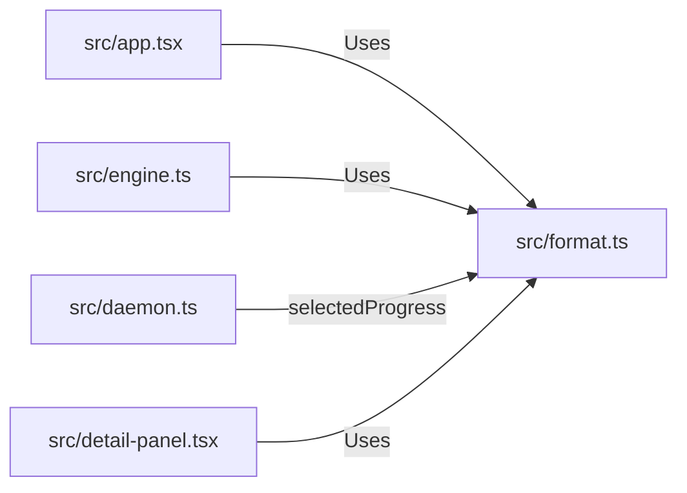

# Component Spec: `src/format.ts`

**File Path:** [src/format.ts](../src/format.ts)  
**Role:** Human-readable byte size and transfer rate formatting, multi-chunk progress bar generator, and glyph rendering.

---

## 1. Functional Specification

`src/format.ts` provides utility functions for converting raw numeric byte metrics into clean, human-readable TUI strings:
1. **`formatBytes(bytes)`**:
   - Converts raw byte values into human-friendly units (`B`, `KB`, `MB`, `GB`, `TB`).
   - Dynamic precision: 0 decimal places for bytes or values >= 100, 1 decimal place for values >= 10, 2 decimal places for values < 10 (`"938 MB"`, `"6.07 GB"`, `"512 B"`).
2. **`formatSpeed(bytesPerSecond)`**:
   - Formats speed rates. Returns `"-"` for idle transfers (`<= 0` or non-finite) to keep TUI tables clean, rather than cluttering with `"0 B/s"`.
3. **`progressSegments(ratio, width)`**:
   - Deconstructs progress bars into 4 distinct text segments:
     - `left`: Thick left edge glyph (`▐`).
     - `filled`: Block fill string (`█` * filled width).
     - `empty`: Empty fill string (`░` * remaining width).
     - `right`: Thick right edge glyph (`▌`).
   - **Boundary Precision Protection**: `clamped < 1` never rounds up to 100% full bar; `clamped > 0` never rounds down to 0% empty bar.
   - Negative ratio (`ratio < 0`) returns `left: "▐"`, `empty: "----------"`, `right: "▌"` for handoff state (`Starting...`).
4. **`progressBar(ratio, width)`**: Concatenates `progressSegments` into a single plain text string for plain contexts.

---

## 2. Technical Specification & Implementation Details

### Segment Decomposition Algorithm

```typescript
export function progressSegments(ratio: number, width = 10): ProgressSegments {
  if (!Number.isFinite(ratio) || ratio < 0) {
    return { left: "▐", filled: "", empty: "-".repeat(width), right: "▌" };
  }
  const clamped = Math.max(0, Math.min(1, ratio));
  let filled = Math.round(clamped * width);
  if (filled === width && clamped < 1) filled = width - 1; // Protect 99.6%
  if (filled === 0 && clamped > 0) filled = 1;               // Protect 0.1%
  return {
    left: "▐",
    filled: "█".repeat(filled),
    empty: "░".repeat(width - filled),
    right: "▌",
  };
}
```

---

## 3. Relationship & Component Connections



---

## 4. Input & Output Structure

- **Inputs**: Numeric byte counts, bytes/sec speed numbers, ratios (0.0 to 1.0).
- **Outputs**: Formatted strings (`"6.07 GB"`, `"2.4 MB/s"`), `ProgressSegments` objects.

---

## `selectedProgress(files, skipped)`: progress over the files you kept

WebTorrent measures both progress and completion against the **whole**
torrent:

```js
get progress () { return this.downloaded / this.length }   // length = every file
const done = this.files.every(file => file.done)           // including skipped ones
```

The client passed those through untouched, so it inherited that definition.
The consequence: a torrent with files unticked **could never reach 100% and
could never report done**. Skipping half the bytes left the bar at 50%
permanently, the status on `Downloading`, and the row never took the green
`Done` wash, for a download that was, as far as the user was concerned,
finished.

`selectedProgress()` recomputes both over the kept files only, and is used by
**`engine.ts` and `daemon.ts` alike**. A backgrounded torrent had the same
bug.

It returns **`null` when there is nothing to correct**, and the caller falls
back to WebTorrent's own values. That happens in two cases, both normal:

| Case | Why null |
|---|---|
| No file list yet | Metadata has not arrived: the loading state |
| Nothing skipped | WebTorrent is already right; recomputing is only a chance to disagree with it |

Re-selecting a file later (Details panel → `toggleFile`) needs no special
handling: the skip set is read **live on every call**, so the kept bytes grow
again and a torrent that read as complete correctly drops back to incomplete.

Three edges are guarded because each would put visible garbage on screen:

- **every file skipped** → `null`, not `NaN` (unreachable, the Add dialog and
  `toggleFile` both refuse it, but a divide-by-zero here would reach the bar)
- **zero-length files**, which are legal in a torrent → `0`, not `NaN`
- **over-download after a re-verify** → clamped to `1`, so the bar cannot
  overflow its own width

Covered by `tests/test-selected-progress.ts` (15 checks).
