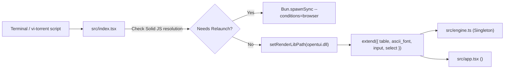

# Component Spec: `src/index.tsx`

**File Path:** [src/index.tsx](../src/index.tsx)  
**Role:** Main application entry point, process bootstrap, browser export condition guard, POSIX signal handlers, OpenTUI component registration, and root renderer setup.

---

## 1. Functional Specification

`src/index.tsx` is responsible for initializing the entire `vi-torrent` application lifecycle:
1. **Relaunch Guard**: Inspects `solid-js` resolution to check if it resolves to `dist/server.js` (non-reactive SSR build). If so, it spawns a child process using `Bun.spawnSync` with `--conditions=browser` and exits the parent process. An environment variable sentinel (`vi-torrent_RELAUNCHED`) prevents infinite respawn loops.
2. **Signal Handlers (`SIGINT`, `SIGTERM`, `SIGHUP`)**: Registers process signal listeners to ensure that closing the terminal or sending a kill signal hands off any background-ticked torrents to the detached daemon (`engine.handoffToBackground()`) and cleans up resources before exiting.
3. **OpenTUI Component Registration**: Calls `extend()` to register custom XML/JSX element tags: `<table />`, `<ascii_font />`, `<input />`, `<select />`.
4. **Native Library Path**: deliberately **not** set. `@opentui/core` resolves its own native library from its `optionalDependencies` for the running platform (`@opentui/core-{darwin,linux,win32}-{x64,arm64}`). An earlier version imported `@opentui/core-win32-x64` directly and called `setRenderLibPath()` with it, which made the package installable on Windows x64 and nowhere else.
5. **Root Component Mounting**: Calls `@opentui/solid`'s `render(() => <App />)` to start the UI event loop.

---

## 2. Technical Specification & Implementation Details

### Export Condition Relaunch Guard

```typescript
const RELAUNCH_SENTINEL = "vi-torrent_RELAUNCHED";

function needsBrowserConditions(): boolean {
  try {
    return Bun.resolveSync("solid-js", import.meta.dir).includes("server");
  } catch {
    return false;
  }
}
```

- **Rationale**: Bun's module resolution algorithm defaults to the `"node"` export condition in `package.json`, causing `solid-js` to load its SSR build where signals update in memory but render effects never fire.
- **Relaunch Logic**: If `needsBrowserConditions()` returns `true`, `Bun.spawnSync` executes:
  `bun --conditions=browser run src/index.tsx [args]`
  inheriting `stdio`.

### Process Signal Teardown

```typescript
for (const signal of ["SIGINT", "SIGTERM", "SIGHUP"] as const) {
  process.on(signal, () => {
    try { engine.handoffToBackground(); } catch {}
    try { engine.destroy(); } catch {}
    setTimeout(() => process.exit(0), 300);
  });
}
```

- Ensures that abrupt terminal closure hands off background-flagged torrents to `src/daemon.ts` so active background downloads do not die silently.

---

## 3. Relationship & Component Connections



---

## 4. Input & Output Structure

- **Inputs**: CLI arguments (`process.argv`), environment variables (`vi-torrent_RELAUNCHED`), OS signals (`SIGINT`, `SIGTERM`, `SIGHUP`).
- **Outputs**: Mounted OpenTUI terminal application frame, child process execution if relaunch required, exit code `0` or `1`.
