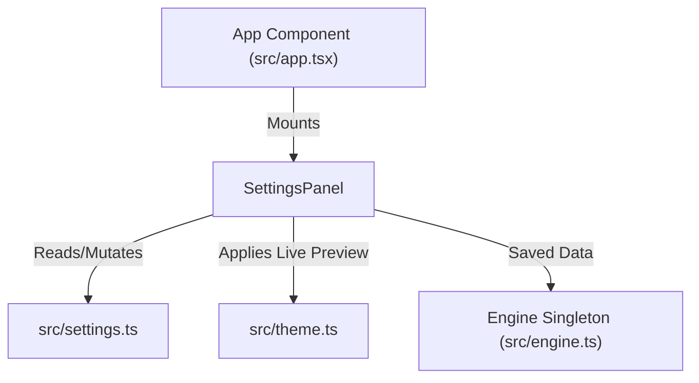

# Component Spec: `src/settings-panel.tsx`

**File Path:** [src/settings-panel.tsx](../src/settings-panel.tsx)  
**Role:** Interactive settings modal overlay, keyboard ladder stepping navigation, live theme preview engine, and configuration save controller.

---

## 1. Functional Specification

`src/settings-panel.tsx` renders the application configuration modal (`/settings` or pressing the `Settings` button):
1. **Field Registry & Ladder Stepping**: Provides arrow-key stepping through all 12 configurable settings without free-text typing:
   - `theme`: Cycles through 12 built-in themes (`claude`, `nord`, `gruvbox`, `dracula`, `matrix`, `tokyo`, `catppuccin`, `solarized`, `light`, `darkplus`, `neon`, `mono`). **Live Preview**: Cycling theme instantly updates the live UI palette so the user sees the theme applied immediately!
   - `downloadLimit` / `uploadLimit`: Steps through a pre-defined speed ladder (`0`, `50 KB/s`, `100 KB/s`, `250 KB/s`, `500 KB/s`, `1 MB/s`, `2 MB/s`, `5 MB/s`, `10 MB/s`).
   - `maxConns`: Steps in increments of 5 between 5 and 500.
   - `sequential`: Toggles `on`/`off` (download pieces in order for streaming).
   - `seedRatioLimit`: Steps by `0.5` between `0` (never stop) and `10.0`.
   - `dht`, `pex`, `lsd`, `portForwarding`: Toggles boolean `on`/`off`.
   - `encryption`: Steps through `0` (off), `1` (prefer), `2` (require).
   - `torrentPort`: Steps port number (`0` = random, or `6881` to `65535`).
2. **Restart Required Tagging**: Marks settings that require a relaunch (`dht`, `pex`, `lsd`, `encryption`, `torrentPort`, `portForwarding`) with `(next launch)`.
3. **Modal Lifecycle**:
   - `Enter` / `Return`: Applies settings via `props.onApply(draft)`. Displays saved notice. Re-applies active theme.
   - `Escape`: Reverts draft settings. If the theme was changed, **restores original theme on open**!
   - `openSettings(focus)`: Opens modal with cursor focused on specific field.

---

## 2. Technical Specification & Implementation Details

### Speed Step Ladder Algorithm

```typescript
const SPEED_STEPS = [0, 50 * KB, 100 * KB, 250 * KB, 500 * KB, 1024 * KB, 2048 * KB, 5120 * KB, 10240 * KB];

function stepThrough<T>(ladder: T[], value: T, dir: number): T {
  const at = ladder.indexOf(value);
  const from = at === -1 ? 0 : at;
  return ladder[Math.max(0, Math.min(ladder.length - 1, from + dir))];
}
```

### Imperative Ref Rendering

```typescript
createEffect(() => {
  const values = draft();
  const at = cursor();
  if (!bodyRef || !values) return;
  bodyRef.content = FIELDS.map((field, index) => {
    const marker = index === at ? "❯ " : "  ";
    const value = describe(field.key, values[field.key]);
    const restart = RESTART_REQUIRED.includes(field.key) ? "  (next launch)" : "";
    const hint = typeof field.hint === "function" ? field.hint(values) : field.hint;
    return marker + field.label.padEnd(20) + value.padEnd(14) + hint + restart;
  }).join("\n");
});
```

---

## 3. Relationship & Component Connections



---

## 4. Input & Output Structure

- **Inputs**: `initial()` getter, `onApply(next)` callback, keyboard navigation events (`Up`, `Down`, `Left`, `Right`, `Enter`, `Escape`).
- **Outputs**: Mutated `AppSettings` object saved to disk, live UI repaint triggers.
