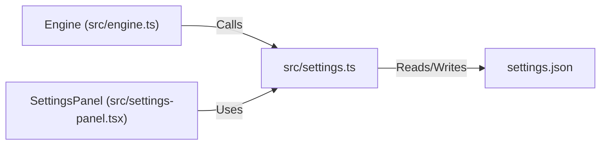

# Component Spec: `src/settings.ts`

**File Path:** [src/settings.ts](../src/settings.ts)  
**Role:** Data model specification, default configuration provider, JSON disk persistence, and human-readable string formatters for settings.

---

## 1. Functional Specification

`src/settings.ts` defines the persistent setting parameters supported by WebTorrent:
1. **`AppSettings` Interface**:
   - `downloadLimit` / `uploadLimit`: Speed caps in bytes/sec (0 = unlimited).
   - `maxConns`: Global peer connection cap (default 55).
   - `savePath`: Default directory for downloaded torrent files.
   - `dht`, `pex`, `lsd`: Boolean peer discovery protocol switches.
   - `encryption`: Encryption preference (`0` = off, `1` = prefer, `2` = require).
   - `torrentPort`: Port for incoming connections (0 = random free port).
   - `portForwarding`: UPnP and NAT-PMP router port mapping.
   - `sequential`: Piece selection strategy flag for streaming media.
   - `seedRatioLimit`: Ratio threshold for auto-pausing completed seeding torrents.
   - `theme`: Theme palette identifier (default `"claude"`).
2. **`RESTART_REQUIRED` Registry**: Array of setting keys (`"dht"`, `"pex"`, `"lsd"`, `"encryption"`, `"torrentPort"`, `"portForwarding"`) that WebTorrent only reads on client initialization.
3. **`defaultSettings()`**: Factory function providing clean initial defaults.
4. **`loadSettings(stateDir)` / `saveSettings(stateDir, settings)`**:
   - Reads/writes `~/.vi-torrent/settings.json`.
   - Merges loaded JSON over `defaultSettings()` to prevent missing or undefined properties from corrupting runtime state.
5. **`describe(key, value)`**: Formats raw setting values into human-readable strings for display in the settings UI.

---

## 2. Technical Specification & Implementation Details

### Merge Strategy

```typescript
export function loadSettings(stateDir: string): AppSettings {
  const file = path.join(stateDir, "settings.json");
  try {
    if (!fs.existsSync(file)) return defaultSettings();
    const parsed = JSON.parse(fs.readFileSync(file, "utf8"));
    return { ...defaultSettings(), ...parsed };
  } catch {
    return defaultSettings();
  }
}
```

---

## 3. Relationship & Component Connections



---

## 4. Input & Output Structure

- **Inputs**: State directory path string, setting key/value pairs.
- **Outputs**: `AppSettings` object, formatted value description strings.
