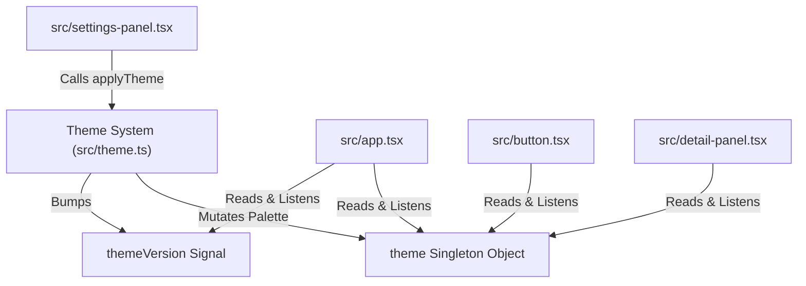

# Component Spec: `src/theme.ts`

**File Path:** [src/theme.ts](../src/theme.ts)  
**Role:** Color palette specifications, theme engine, mutable theme singleton object, reactive `themeVersion` signal, and slash command registry.

---

## 1. Functional Specification

`src/theme.ts` provides styling and command registration for `vitorrent-node`:
1. **12 Curated Terminal Palettes**: the full roster and its rules are in
   [Theme roster](#theme-roster-12) below. A sample:
   - `claude` (Default): Terracotta coral (`#D97757`) on warm black (`#1A1815`).
   - `nord`: Cool arctic blues (`#88C0D0`) on slate (`#2E3440`).
   - `gruvbox`: Retro warm orange (`#FE8019`) on dark grey (`#282828`).
   - `dracula`: Purple (`#BD93F9`) & pink on deep grey (`#282A36`).
   - `matrix`: High-contrast green phosphor (`#00FF41`) on pitch black (`#0B0F0B`).
   - `mono`: Clean greyscale (`#E8E6E3`) with red errors (`#FF8080`).
2. **Progress Color Protection**:
   - `progress` property is explicitly set to green across ALL themes (including `mono`) to ensure progress bars remain visually distinguishable from table background colors.
3. **Mutable Palette Singleton Architecture**:
   - Exported `theme: Palette` is a mutable object created via `{ ...THEMES[0].palette }`.
   - `applyTheme(name)` uses `Object.assign(theme, found.palette)` to update properties in place.
   - **Why In-Place Assignment?**: All UI components import `import { theme }` and hold a reference to the same object. Mutating in place updates all components instantly without requiring component re-renders or breaking module imports.
4. **`themeVersion` Signal**: Bumped on every `applyTheme()` call. Components read `themeVersion()` in `createEffect` to trigger imperative repaints.
5. **`COMMANDS` Single Source of Truth**:
   - Central registry for all 9 slash commands (`/add-magnet`, `/add-file`, `/pause`, `/resume`, `/remove`, `/details`, `/theme`, `/settings`, `/quit`).
   - `matchCommands(input)`: Case-insensitive prefix matcher for slash command autocomplete.

---

## 2. Technical Specification & Implementation Details

### Mutable Singleton Theme Mutation Pattern

```typescript
export const theme: Palette = { ...THEMES[0].palette };

const [themeVersion, setThemeVersion] = createSignal(0);
export { themeVersion };

export function applyTheme(name: string): boolean {
  const found = THEMES.find(t => t.name === name.trim().toLowerCase());
  if (!found) return false;
  Object.assign(theme, found.palette); // Modifies original object reference!
  activeName = found.name;
  setThemeVersion(v => v + 1); // Triggers subscribers
  return true;
}
```

---

## 3. Relationship & Component Connections



---

## 4. Input & Output Structure

- **Inputs**: Theme name strings, command search inputs.
- **Outputs**: Active `theme` object, `COMMANDS` spec array, matching command search results.

---

## Two hues per palette, not one

Every palette carries `accent2` (a genuinely different hue from `accent`) and `info` (a third, cooler one). Without them a theme is one colour plus greys: the accent drives the logo, headers, buttons and selection, so a coral theme reads as coral-on-grey however many role colours the table uses. `mono` keeps grey for `accent2` on purpose.

A test computes the hue angle of `accent` and `accent2` for every theme and fails if they are within 40°, so a future palette cannot quietly reintroduce a single-hue theme.

## `dimText()`: readable secondary text

`muted` is tuned to sit back visually, and in most palettes it sits back too far to *read*: ten of the twelve fell under the 4.5:1 WCAG AA contrast threshold against their own background. `dimText()` lifts `muted` towards `text` until it clears 4.5:1, and is cached per theme. `contrastRatio(a, b)` is exported for the test that enforces this.

## Theme roster (12)

`claude`, `nord`, `gruvbox`, `dracula`, `matrix`, `tokyo`, `catppuccin`,
`solarized`, `light`, `darkplus`, `neon`, `mono`.

Eleven are dark; `light` is the only light-background palette, a near-white
`#F7F7F7` ground with a blue accent.
