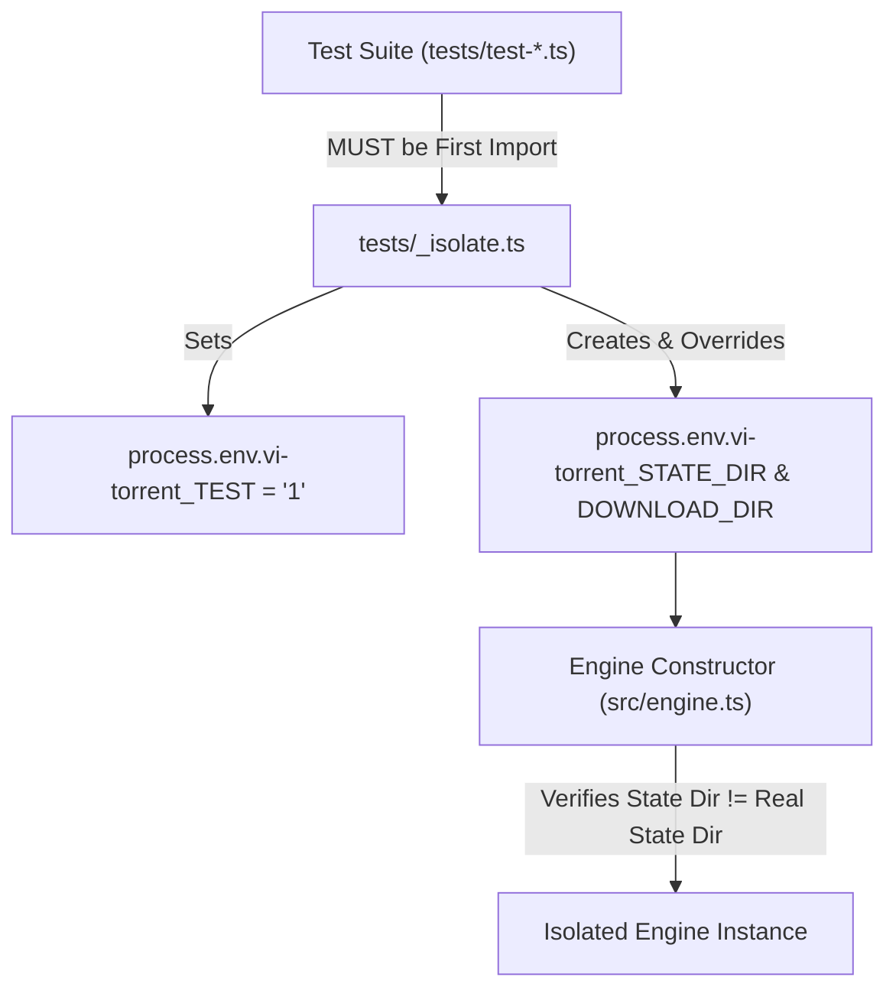

# Technical Specification: `vitorrent-node` Test Suite (39 Test Modules)

**Test Directory:** `tests/`  
**Test Runner:** Bun Test Runner (`bun test` or `bun tests/test-*.ts`)  

---

## 1. Test Suite Architecture & Safety Protocols

All test modules in `vitorrent-node` follow strict isolation protocols to prevent test runs from writing to or corrupting the user's live BitTorrent session (`~/.vi-torrent/session.json` or `~/.vi-torrent/settings.json`):



---

## 2. Comprehensive Test File Catalog & Functional Specs

### 1. `tests/_isolate.ts`
- **Role**: Test isolation helper module.
- **Functionality**:
  - Sets `process.env.vi-torrent_TEST = "1"`.
  - Creates a unique temporary directory in OS temp space (`fs.mkdtempSync`).
  - Sets `vi-torrent_STATE_DIR` and `vi-torrent_DOWNLOAD_DIR` to isolated temp sub-folders.
  - Registers process exit hook to recursively remove temporary test directories on exit.

### 2. `tests/test-addfile.ts`
- **Role**: Unit & integration test for `/add-file` command and `.torrent` validation.
- **Functionality**:
  - Asserts that adding non-existent files throws `"File not found"`.
  - Asserts that adding directories throws `"That is a folder, not a .torrent file"`.
  - Asserts that passing an HTML file (e.g. 404 response page) throws `"Not a .torrent file (looks like HTML - a failed download?)"`.
  - Asserts that passing corrupt binary data throws `"Not a valid .torrent file (bad bencode header)"`.

### 3. `tests/test-all-bugs.tsx`
- **Role**: Combined regression test suite for historical UI and rendering bugs.
- **Functionality**:
  - Verifies table content formatting headers, progress bar colors, checkbox selection markers.
  - Validates key intercept pass-through behavior.
  - Ensures no unhandled rejections escape during UI component re-renders.

### 4. `tests/test-autocomplete.tsx`
- **Role**: Slash command suggestion box test suite.
- **Functionality**:
  - Verifies `matchCommands("/")` returns every available slash command.
  - Verifies prefix matching (e.g. `/p` returns `/pause`).
  - Tests suggestion box windowing (`MAX_SUGGESTIONS = 6`) and arrow key scrolling.
  - Tests `Tab` auto-completion into the input.

### 5. `tests/test-background-restored.ts`
- **Role**: Integration test for background daemon handoffs across TUI restarts.
- **Functionality**:
  - Ticks background flag on torrents.
  - Simulates TUI process exit (`handoffToBackground()`).
  - Verifies that spawning a new TUI instance re-attaches to background status without adding duplicate local torrents.

### 6. `tests/test-background.ts`
- **Role**: Detached background daemon process integration suite.
- **Functionality**:
  - Tests `DaemonClient.spawnDetached()`.
  - Verifies single-instance lock via `daemon.json` and PID liveness.
  - Tests HTTP control endpoints (`/status`, `/add`, `/pause`, `/resume`, `/remove`, `/shutdown`).
  - Asserts HTTP 403 response when passing invalid authorization token.

### 7. `tests/test-badinput.ts`
- **Role**: Magnet link and input validation test suite.
- **Functionality**:
  - Tests magnet link regex matching (`magnet:?xt=urn:btih:`).
  - Asserts immediate rejection of malformed magnet strings before passing to WebTorrent.

### 8. `tests/test-buttons.tsx`
- **Role**: Top action button bar test suite.
- **Functionality**:
  - Tests button press handlers for `Pause`, `Resume`, `Remove`, `Background`, `Details`, `Settings`, `Quit`.
  - Verifies 2-click delete safety arming on `Remove + Files`:
    - First click sets `armedDeleteKey` - the joined ids of the whole target set - and paints the button in the red danger tone, naming the count when more than one is ticked.
    - Changing the selection disarms the delete confirm.
    - Second click fires destructive file and directory removal.

### 9. `tests/test-details.tsx`
- **Role**: Torrent details overlay modal test suite.
- **Functionality**:
  - Verifies rendering of multi-file list inside `/details`.
  - Tests toggling file inclusion/skipping via `Space`, `Left`, `Right` keys.
  - Asserts error when attempting to deselect all files in a torrent.
  - Tests peer list display and capping (`+ N more`).

### 10. `tests/test-enter.tsx`
- **Role**: Enter key command execution test suite.
- **Functionality**:
  - Verifies command submission logic.
  - Tests exact-match check preventing argument-less commands (like `/quit` or `/settings`) from getting trapped in auto-completion loops on Enter.

### 11. `tests/test-ids.ts`
- **Role**: Stable torrent ID allocation test suite.
- **Functionality**:
  - Verifies non-reusable incremental integer ID mapping (`idByInfoHash`).
  - Asserts that removing a torrent in the middle of the table does not shift or corrupt IDs of remaining torrents.

### 12. `tests/test-mouse.tsx`
- **Role**: Mouse interaction test suite.
- **Functionality**:
  - Tests screen Y coordinate mapping (`selectRowAt`): a click ticks a row and moves the cursor there, and clicking again unticks it.
  - Tests mouse click selection in slash command autocomplete box (`chooseSuggestionAt`).
  - Tests button click dispatches.

### 13. `tests/test-persistence.ts`
- **Role**: Session persistence engine test suite.
- **Functionality**:
  - Tests JSON serialization to `session.json`.
  - Verifies `.torrent` file byte caching in `torrents/<infoHash>.torrent`.
  - Asserts that restored torrents re-attach in `paused` state without downloading automatically.

### 14. `tests/test-remove-files.ts`
- **Role**: Recursive directory cleanup test suite.
- **Functionality**:
  - Tests `removeTorrentFolder(savePath, torrentName)`.
  - Verifies deletion of empty directory trees after `destroyStore` removes files.
  - Asserts that folders containing user files are left intact.
  - Verifies path traversal protection (`..`).

### 15. `tests/test-restore-ui.tsx`
- **Role**: Terminal buffer restoration test suite.
- **Functionality**:
  - Tests `shutdown()` sequence.
  - Verifies output of ANSI escape codes leaving alternate screen buffer (`\x1b[?1049l`) and showing cursor (`\x1b[?25h`).

### 16. `tests/test-resume.ts`
- **Role**: Peer discovery re-announcement test suite.
- **Functionality**:
  - Tests `rediscover(torrent)` trigger.
  - Asserts tracker update (`tracker.update()`) and DHT lookup (`dht.lookup()`) execution on unpause.

### 17. `tests/test-settings.tsx`
- **Role**: Settings overlay modal test suite.
- **Functionality**:
  - Tests ladder stepping through all 12 configurable settings.
  - Verifies live theme preview application while cycling themes.
  - Tests `(next launch)` tagging for restart-required settings.
  - Verifies `Escape` key theme restoration on cancel.

### 18. `tests/test-table.tsx`
- **Role**: Torrent table component test suite.
- **Functionality**:
  - Verifies 10-column table headers (`SEL`, `BG`, `ID`, `Name`, `Size`, `Progress`, `Down`, `Up`, `Ratio`, `Status`).
  - Tests progress bar chunking with green progress colors.
  - Tests checkbox marker rendering (`[ ]` / `[x]`), and that nothing is ticked on a fresh table.
  - Tests `Ratio` column formatting (`ratio.toFixed(2)` or `-`).

### 19. `tests/test-themes.tsx`
- **Role**: Theme palette & switching test suite.
- **Functionality**:
  - Tests `/theme <name>` command switching across all 12 built-in themes.
  - Verifies in-place palette object mutation (`Object.assign(theme, found.palette)`).
  - Verifies green progress color override across all palettes.

---

## 3. Test Execution Command & Verification

To run the complete test suite:

```bash
bun test
# or run an individual test suite:
bun tests/test-table.tsx
```

---

## `tests/test-visuals.tsx`

- **Role**: Logo wave geometry, avatar animation, and theme palette integrity.
- **Coverage**:
  - `logoCells()` parses to the font's line count and pads every row to equal width (a ragged grid would skew the wave).
  - `wavePosition()` peaks, troughs, stays within `0..1`, and moves with phase; `blend()` endpoints and clamping.
  - The avatar is never a single frame in **either** state - running cycles through several poses, idle blinks and shifts weight - and every running frame is the same height so the header cannot jitter.
  - Ten themes exist, each defines a `progress` colour, and the `light` theme really is light.
  - On screen: the logo is painted beside the avatar and drawn in many colours rather than one flat fill.
- **Explicitly NOT covered**: whether the animation actually advances on screen. `captureSpans()` drives a render itself, so any time-sampled check passes with the bug present - verified by disabling `requestLive()` and watching such a check still pass. Real terminal only.

---

## `tests/test-rowstate.tsx`

- **Role**: Row backgrounds for finished and failed torrents, and the `Failed` status itself.
- **Coverage**: a completed torrent reports `Done`; a torrent whose `error` fires reports `Failed`, outranking the other states; the two rows carry *different* painted backgrounds, matching the expected faint success/error tints and **not** the raw colours.
- **Note**: failure is injected by emitting the error a torrent would emit, so no network is needed.

---

## `tests/test-addpanel.tsx`

- **Role**: The Add dialog end to end.
- **Coverage**: `/add-file` opens the dialog instead of adding; nothing enters the list or the session index until confirmed; metadata loads and the file list, sizes and swarm line render; clicking a file row toggles it; `left`/`right` are explicit and `space` flips; the **Add button** commits with the skip applied and persisted; the **Cancel button** leaves no session entry.
- **Two traps this suite documents**: clicks at a low `x` land on the table *behind* the inset dialog, and matching `"Add"` finds the title line (`Add torrent: ...`) before the button row.

---

## `tests/test-selected-progress.ts`

- **Role**: progress and completion measured over the files the user **kept**, not the whole torrent.
- **Why it exists**: WebTorrent defines `progress` as `downloaded / length` across *every* file, and `done` as `files.every(f => f.done)`, so a torrent with files unticked could never reach 100% and never report done. The client passed those numbers straight through and inherited the definition.
- **Coverage**: the null cases where WebTorrent is already correct (no metadata yet, nothing skipped); a kept file at 100% reporting done while a skipped file is unfinished; partial progress measured over kept bytes only; several kept files all having to finish; re-selecting a file dropping a "complete" torrent back to incomplete.
- **Edges that would otherwise reach the screen as garbage**: every file skipped (`NaN`), zero-length files (divide by zero), and an over-download after re-verification (a bar wider than its own width).
- **Pure, so no network and no renderer**, it exercises `selectedProgress()` directly rather than staging a real transfer.

---

## `tests/test-layout.tsx`

- **Role**: the app stays usable at any terminal size.
- **Coverage**: resizes a live renderer through 120x30, 100x10, 60x18, 45x12 and back, the block logo appears only when there is room and returns when the window grows; every button stays reachable when the row wraps; and with five torrents in a 14-row terminal the table clips rather than painting through the prompt.
- **The assertion that matters**: the prompt must be **present *and* unpolluted**, checked together. Overflow has two shapes, painted over, or pushed off screen, and an earlier version that only looked for stray box-drawing characters passed happily against a prompt that was not there at all.

---

## `tests/test-bg-toggle-race.ts`

- **Role**: toggling BG faster than the handover completes must not lose the row.
- **Why it exists**: reported from real use: clicking Background on/off repeatedly made the line item disappear with *"could not reach the background downloader"*. Reproduced before fixing; the row vanished so completely that the next click threw `No torrent with id 0`.
- **Coverage**: three on/off cycles at 60ms, then four alternating **BG ↔ Stop background** cycles at 40ms, the bug reproduced from either button, since both go through `toggleBackground()`. Asserts the row survives, ends up locally owned and unflagged, no "could not reach" error is raised, no daemon is left running, and the session index agrees with the screen.
- **The assertion that matters**: a 25ms sampler runs throughout and asserts the row was **never absent, not even momentarily**. Checking only the final state would pass on a gap the user would have watched happen, and "the line disappeared" is a statement about what is on screen.

---

## `tests/test-bg-button-state.tsx`

- **Role**: the Background button is unclickable while a torrent is changing hands.
- **Coverage**: the label is `[ ] Background` before ticking, becomes `... handing over` while the row reads `Starting...` (neither side owns it), and returns to a checkbox once the handover is cancelled.
- **Also proves `Stop background` is safe mid-handover** rather than assuming it. It stays enabled in that window on purpose: it releases *every* background torrent, so disabling it would mean you could not stop the others.

---

## `tests/test-bg-panel.tsx`

- **Role**: the Background dialog, decide, then Save.
- **Coverage**: clicking Background opens a dialog and does **not** hand the torrent over; ticking changes the screen while the engine stays untouched; the dialog states what Save will do; Cancel discards; Save applies; re-opening reflects the real current state; unticking through the same dialog brings the torrent back.
- **The trap it documents**: the body line "On Save: handed to the background downloader" comes *before* the button row, so clicking the first line containing "Save" clicks explanatory text. The button row is the one carrying **both** buttons, the same shape as the Add dialog's title-versus-button trap.

---

## `tests/test-header-stale.tsx`

- **Role**: the header describes the current state, not the one it saw at startup.
- **Why it exists**: reported with a screenshot, an empty table under "Reattached 1 torrent from your last session · paused, click Resume to continue". The count was captured once at launch and could never retire.
- **Coverage**: seeds a previous session with a throwaway engine, mounts the app, checks the reattach notice appears, then **removes** the torrent and checks the notice is gone and the plain tagline is back.

---

## `tests/test-magnet-preview.ts`

- **Role**: a magnet preview must be able to fetch its own metadata.
- **Why it exists**: the entire suite passed while every magnet link was broken, because every other suite builds a `.torrent` file, which carries metadata already. The magnet path had **no coverage at all**.
- **Coverage**: offline, against a real tracker and seeder on localhost, metadata arrives for a magnet preview, **no file data is fetched while deciding**, and after Add the kept file is selected, the skipped one is not, and the download actually progresses.
- Verified to fail against the old `paused: true` preview.

---

## `tests/test-metadata-cache.ts`

- **Role**: a cached `.torrent` must contain real metadata, or not exist.
- **Why it exists**: WebTorrent exposes `torrentFile` *before* metadata arrives, a ~165-byte stub with no `info` dictionary. It was cached and never overwritten, so every launch restored an unparseable torrent that failed instantly, forever. Found on a live session with two 165-byte files.
- **Coverage**: caches a real torrent, then **poisons the cache with a stub exactly as the old code did**, and checks that restoring deletes it, raises no parse error, and leaves the session index intact.

---

## `tests/test-restore-magnet-resume.ts`

- **Role**: a magnet restored *without* cached metadata must resolve when resumed.
- **Why it exists**: after the stub cleanup a session legitimately holds magnets with no usable `.torrent`. They restore paused showing `0 B`, honest, but useless unless Resume works, and a paused torrent cannot fetch metadata at all. Everything rests on `rediscover()` forcing a fresh announce.
- **Coverage**: builds that exact state against a real localhost tracker, then checks Resume fetches the metadata, the size and file list appear, and **the real metadata is cached so the next launch needs none of it**.

---

## `tests/test-rediscover-throttle.ts`

- **Role**: forced announces are throttled, so the client cannot hammer a tracker.
- **Why it exists**: `resume()`, `restore()`, `confirmPreview()` and the background handover all forced a tracker announce with no floor at all, which trackers publish a minimum interval to discourage.
- **Written on a wrong diagnosis, and kept anyway**: the trigger was two torrents at zero peers with Ubuntu's trackers returning HTTP 400, blamed on self-inflicted rate limiting. A hand-built announce to the same tracker moments later returned HTTP 200 with a full peer list, so nothing had been refused. See [the helpers spec](doc_src_helpers.md). The throttle is still correct behaviour; the reason recorded for it was not.
- **Coverage**: a burst of five calls announces once; the **DHT is still asked every time**; the window is per-torrent; `forgetAnnounce()` releases it; a missing or throwing tracker is handled quietly.
- **Also guards the over-correction**: an announce 11s later must be allowed. The first version used a 60-second window, which broke add → pause → resume, caught by `test-resume.ts`, not by this file.

---

## `tests/test-instance-lock.ts`

- **Role**: one vi-torrent window per state directory.
- **Coverage**: acquire, refuse while a live pid holds it, take over a stale lock from a crash, re-acquire our own, release only our own, and start anyway when the lock location is unwritable.
- **A test assumption failed here, not the code**: `pid 1` does not exist on Windows, where the lowest real pid is 4. It uses `process.ppid`.

---

## `tests/test-handoff.ts`

- **Role**: the inbox that carries an OS-handed magnet link or `.torrent` path into the window already open, see [`handoff.ts`](doc_src_handoff_ts.md).
- **Coverage**: what counts as a link (and that an `http` URL and a bare flag do not), relative `.torrent` paths resolved to absolute, drop and pick up, reads being destructive so nothing is added twice, oldest-first ordering, the 5-minute stale cutoff, junk files cleared rather than left to jam the queue, and both sides resolving the same state directory.
- **A real bug this caught before it shipped**: the drop filename was `<ms>-<pid>`, so two links dropped in the same millisecond by the same process silently overwrote one another. Now carries a zero-padded counter, padded because unpadded, `"10"` sorts before `"2"`.

---

## `tests/test-handoff-pickup.tsx`

- **Role**: the receiving half, the running window turning a dropped link into the Add dialog.
- **Driven through the real 1-second tick**, not by calling the handler directly. The tick is the only thing that reads the inbox, so a test that bypassed it would still pass with the wiring removed.
- **Coverage**: a link waits while another dialog is open rather than destroying what the user was doing, opens once that closes, drains the inbox, does not re-open after being consumed, ignores junk, and survives a `.torrent` path pointing at a file that no longer exists.

---

## `tests/test-multiselect.tsx`

- **Role**: ticking several torrents and acting on all of them, see [the feature spec](doc_multiselect.md).
- **Coverage**: nothing ticked on launch, All/None, bulk pause and resume, a partial selection leaving the untouched torrent running, `/select-all` and `/select-none`, the armed delete naming its count, disarming when the selection changes, and a real bulk delete.
- **The check that matters most**: *with nothing ticked, an action applies to the cursor row*. Without that fallback, pausing one torrent would mean ticking it first, worse than the single-selection behaviour this replaced. It is asserted, not assumed.
- **Buttons are located bottom-up**, because a torrent named like a button label would otherwise capture the click.

---

## Every suite that builds a client needs `platformOptions()`

A `new WebTorrent(...)` without it runs on Windows and **panics** on macOS and
Linux, see [`webtorrent-platform.ts`](doc_src_webtorrent_platform_ts.md). A
panic is not catchable, so the suite dies with no FAIL lines and the sweep
reports it as broken rather than failed.

It is re-exported from `_isolate.ts` on purpose: importing it directly would
put a line **above** `import "./_isolate.js"`, and that import has to be first.

Nine suites needed patching when this arrived, and a hand-written list of them
missed three. To find any that were forgotten:

```bash
grep -n "new (\?WebTorrent" tests/*.ts tests/*.tsx | grep -v platformOptions
```

---

## Shared test helpers (`tests/_isolate.ts`)

Beyond the isolation guard, this module now carries what every suite used to copy:

| Helper | Replaces |
| :--- | :--- |
| `checks()` | the `fails` counter, `ck()`, and the exit tail in every suite |
| `settle(waitForVisualIdle, ms)` | ten near-identical wait helpers |
| `buildTorrent(dir, name, entries)` | the seed-then-destroy dance in 7 suites |
| `addTorrentNow(engine, source)` | preview + confirm, since there is no immediate-add API |
| `rgbOf()` / `spanColours()` | hand-rolled colour probes in 7 suites |

**A caution learned here**: a suite that fails to parse produces *no* FAIL lines, so a sweep grepping only for `FAIL` reports it as green. One suite silently ran zero checks after a refactor. Any sweep should also flag a suite that emits **no checks at all**.
