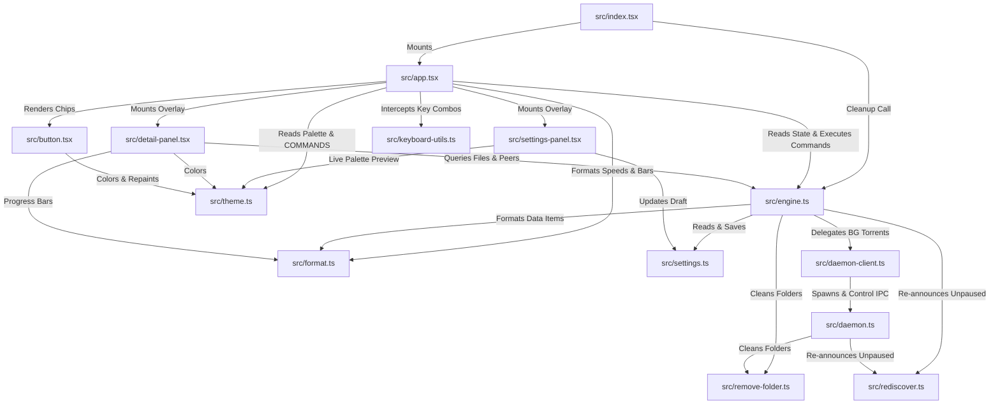

# vitorrent-node: Inter-Module Relationship Matrix & Dependency Mapping

This document provides a 100% comprehensive mapping of all inter-file relationships, import/export networks, data contracts, signal bindings, and IPC channels across every file in `vitorrent-node`.

---

## 1. Master Inter-Module Relationship Matrix

| Source File | Direct Dependencies (Imports) | Dependent Modules (Used By) | Data & Signal Relationship | Communication Channel |
| :--- | :--- | :--- | :--- | :--- |
| **`src/index.tsx`** | • `src/app.tsx` • `src/engine.ts` | Entry Point (Executed by Bun runtime) | Spawns `--conditions=browser` child process; calls `engine.handoffToBackground()`; mounts `<App />`. | In-Process execution / CLI child process spawn |
| **`src/app.tsx`** | • `src/engine.ts` • `src/button.tsx` • `src/settings-panel.tsx` • `src/detail-panel.tsx` • `src/theme.ts` • `src/format.ts` • `src/keyboard-utils.ts` | • `src/index.tsx` | Main UI container. Queries `engine.getTorrents()`, handles command bar dispatches, passes signals & callbacks to modals. | In-Process SolidJS reactive signals & imperative ref updates |
| **`src/engine.ts`** | • `src/daemon-client.ts` • `src/settings.ts` • `src/format.ts` • `src/remove-folder.ts` • `src/rediscover.ts` | • `src/index.tsx` • `src/app.tsx` • `src/detail-panel.tsx` • `src/settings-panel.tsx` | Central state singleton. Reads/writes `session.json`, manages WebTorrent instance, delegates background downloads to `DaemonClient`. | In-Process function calls & File I/O |
| **`src/daemon.ts`** | • `src/rediscover.ts` • `src/remove-folder.ts` | Autonomous process spawned by `DaemonClient` | Detached process. Reads `session.json` on startup, writes `daemon-status.json` every 1s, runs HTTP server on `127.0.0.1`. | Dual Channel: Sync File Write + Async HTTP POST IPC |
| **`src/daemon-client.ts`** | *Node stdlib (`child_process`, `fs`, `path`)* | • `src/engine.ts` | TUI client for background daemon. Reads `daemon-status.json` synchronously; sends HTTP POST commands to `127.0.0.1`. | Dual Channel: Sync File Read + Async HTTP POST IPC |
| **`src/settings-panel.tsx`**| • `src/settings.ts` • `src/theme.ts` | • `src/app.tsx` | Overlay modal. Modifies `draft` settings, calls `engine.applySettings()`, triggers live `applyTheme()` preview. | In-Process SolidJS signals & exported `handleKey` router |
| **`src/settings.ts`** | *Node stdlib (`fs`, `path`, `os`)* | • `src/engine.ts` • `src/settings-panel.tsx` | Data model for app settings. Loads/saves `settings.json`, provides `defaultSettings()`, formats human-readable strings (`describe`). | In-Process function calls & File I/O |
| **`src/detail-panel.tsx`** | • `src/theme.ts` • `src/format.ts` • `src/engine.ts` | • `src/app.tsx` | Overlay modal (`/details`). Queries `engine.getFiles()` & `getPeers()`, triggers `engine.toggleFile()` on Space key. | In-Process SolidJS signals & exported `handleKey` router |
| **`src/button.tsx`** | • `src/theme.ts` | • `src/app.tsx` | Clickable 1-row button chip. Listens to `themeVersion()`, handles hover background fills, dispatches `onPress()`. | In-Process SolidJS signals & native OpenTUI hit grid |
| **`src/theme.ts`** | *SolidJS (`createSignal`)* | • `src/app.tsx` • `src/button.tsx` • `src/settings-panel.tsx` • `src/detail-panel.tsx` | Palette singleton (`theme`), `themeVersion()` signal, `applyTheme()`, `COMMANDS` registry for autocomplete. | In-Process mutable object singleton & signal subscriptions |
| **`src/format.ts`** | *None* | • `src/app.tsx` • `src/engine.ts` • `src/detail-panel.tsx` | Pure utility functions: `formatBytes()`, `formatSpeed()`, `progressSegments()`, `progressBar()`. | In-Process pure function calls |
| **`src/keyboard-utils.ts`**| *OpenTUI (`KeyEvent`)* | • `src/app.tsx` | Wraps `inputRef.handleKeyPress` on input instance to intercept key combos before native input consumes them. | In-Process method overriding |
| **`src/remove-folder.ts`** | *Node stdlib (`fs`, `path`)* | • `src/engine.ts` • `src/daemon.ts` | Directory cleanup helper. Recursively verifies `holdsNoFiles()` and deletes empty folder trees after `destroyStore`. | In-Process function calls & File I/O |
| **`src/rediscover.ts`** | *None* | • `src/engine.ts` • `src/daemon.ts` | Unpause trigger utility. Calls `tracker.update()` and `dht.lookup()` on WebTorrent torrent instance. | In-Process function calls |
| **`src/bun.d.ts`** | *None* | TypeScript Compiler (`tsc`) | Ambient type declarations for Bun runtime methods (`Bun.spawnSync`, `Bun.resolveSync`). | Type-checking compilation |

---

## 2. Mermaid Structural Dependency Network

---

## 3. Data Flow & Event Interconnection Specifications

### Data Contract 1: TUI App ↔ Engine (`src/app.tsx` ↔ `src/engine.ts`)
- **Direction**: Bi-directional
- **Data Passed**: `TorrentItem[]` (containing `id`, `name`, `size`, `progress`, `progressRatio`, `downSpeed`, `upSpeed`, `ratio`, `status`, `background`, `remote`, `infoHash`).
- **Trigger**: `app.tsx` calls `engine.getTorrents()` on every 1-second refresh timer tick. Commands (`/pause`, `/resume`, `/remove`, `toggleBackground`, `toggleFile`) pass integer IDs back to engine.

### Data Contract 2: Engine ↔ Daemon Client (`src/engine.ts` ↔ `src/daemon-client.ts`)
- **Direction**: Bi-directional
- **Data Passed**: `DaemonTorrent[]` (snapshot array) and HTTP command payloads (`{ infoHash, deleteFiles }`).
- **Channel**:
  - `DaemonClient.torrents()` reads `daemon-status.json` synchronously from disk every second.
  - Commands (`add`, `pause`, `resume`, `remove`, `shutdown`) call HTTP POST endpoints on `http://127.0.0.1:<port>` with `x-vi-torrent-token`.

### Data Contract 3: Settings Panel ↔ Theme Engine (`src/settings-panel.tsx` ↔ `src/theme.ts`)
- **Direction**: Bi-directional
- **Data Passed**: Theme name strings (`claude`, `nord`, `gruvbox`, `dracula`, `matrix`, `tokyo`, `catppuccin`, `solarized`, `light`, `darkplus`, `neon`, `mono`).
- **Trigger**: Cycling `Theme` in settings panel immediately calls `applyTheme(stepped)`, which executes `Object.assign(theme, found.palette)` and increments `themeVersion()`, repainting all UI components instantly. Cancel (`Escape`) calls `applyTheme(originalOnOpen)` to restore original palette.

### Data Contract 4: Engine ↔ Session Index File (`src/engine.ts` ↔ `~/.vi-torrent/session.json`)
- **Direction**: File Read/Write
- **Data Passed**: `PersistedTorrent[]` (`infoHash`, `magnetURI`, `savePath`, `name`, `length`, `background`, `skipped`).
- **Trigger**: Written on every torrent add, remove, metadata ready, or background toggle. Read on startup by both TUI engine and background daemon.
