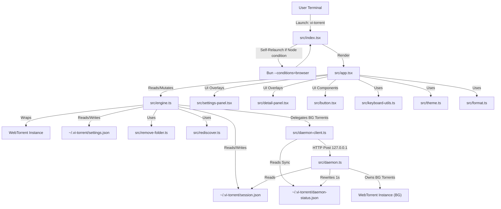
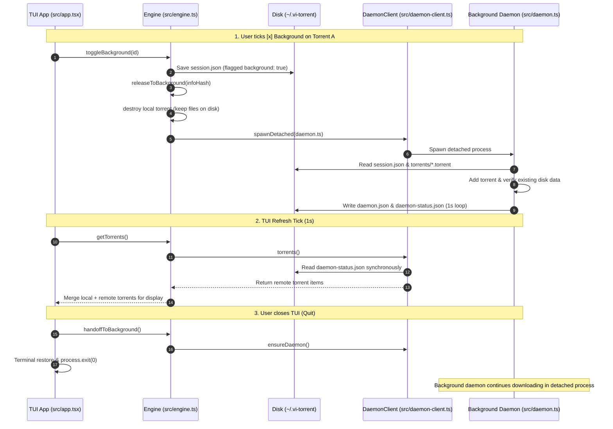

# vitorrent-node: Master Architecture & Component Specification Index

**Project Location:** repository root  
**Runtime:** Bun v1.3.14  
**UI Engine:** `@opentui/core` + `@opentui/solid` (SolidJS custom renderer for Zig-native terminal interface)  
**BitTorrent Core:** `webtorrent` v3.0.21  

---

## 1. Executive Summary & File Inventory

`vitorrent-node` is a full-featured, terminal-native BitTorrent client built in TypeScript for Bun. It features an event-driven terminal user interface (TUI) powered by OpenTUI/SolidJS and a decoupled background daemon architecture that allows torrent downloads to persist seamlessly across terminal restarts.

### File Count Summary
- **Source Modules (`src/`)**: 15 files
- **Test Modules (`tests/`)**: 20 files (19 test suites + 1 README)
- **Configuration & Root Files**: 2 files (`package.json`, `README.md`)
- **Total Project Corpus**: 37 files

### Master File Manifest

| Directory | Filename | Size (Bytes) | Role & Primary Function |
| :--- | :--- | :--- | :--- |
| `src/` | [`index.tsx`](../src/index.tsx) | 2,824 | Main entry point, `--conditions=browser` re-exec guard, signal handlers |
| `src/` | [`app.tsx`](../src/app.tsx) | 29,413 | Main TUI shell, layout composition, slash command dispatcher, button row |
| `src/` | [`engine.ts`](../src/engine.ts) | 31,915 | Core WebTorrent engine wrapper, session index persistence, daemon handoff |
| `src/` | [`daemon.ts`](../src/daemon.ts) | 8,639 | Detached background process, 1s status file writer, HTTP control server |
| `src/` | [`daemon-client.ts`](../src/daemon-client.ts) | 3,812 | TUI client for background daemon, sync status reader, async HTTP proxy |
| `src/` | [`settings-panel.tsx`](../src/settings-panel.tsx) | 8,465 | Settings overlay modal, arrow-key stepping ladder, live theme preview |
| `src/` | [`settings.ts`](../src/settings.ts) | 3,757 | AppSettings data model, defaults, JSON load/save, value formatters |
| `src/` | [`detail-panel.tsx`](../src/detail-panel.tsx) | 5,285 | Torrent details overlay (`/details`), per-file selection, live peer list |
| `src/` | [`button.tsx`](../src/button.tsx) | 3,337 | Borderless 1-row clickable button component, hover state, 2-click confirm |
| `src/` | [`theme.ts`](../src/theme.ts) | 6,401 | 12 color palettes, mutable theme singleton, `COMMANDS` single source of truth |
| `src/` | [`format.ts`](../src/format.ts) | 2,714 | Scaling byte/speed formatters, multi-chunk progress bar generator |
| `src/` | [`keyboard-utils.ts`](../src/keyboard-utils.ts) | 1,868 | Instance key interception wrapper for focused text inputs |
| `src/` | [`remove-folder.ts`](../src/remove-folder.ts) | 2,174 | Safe recursive directory remover for destroyed multi-file torrents |
| `src/` | [`rediscover.ts`](../src/rediscover.ts) | 970 | Tracker re-announce and DHT lookup trigger on unpause |
| `src/` | [`bun.d.ts`](../src/bun.d.ts) | 582 | Ambient type declarations for Bun runtime APIs |
| `tests/` | `_isolate.ts` | 1,329 | Test isolation setup (`vi-torrent_TEST=1`, temp directory override) |
| `tests/` | `test-addfile.ts` | 1,233 | Tests `.torrent` bencode header checks and HTML rejection |
| `tests/` | `test-all-bugs.tsx` | 2,859 | Regression suite for historical rendering & selection bugs |
| `tests/` | `test-autocomplete.tsx` | 2,641 | Tests `/` command suggestion list filtering, windowing, Tab completion |
| `tests/` | `test-background-restored.ts` | 5,441 | Tests background downloader handoff & resume semantics |
| `tests/` | `test-background.ts` | 4,982 | Tests detached daemon process creation and HTTP IPC control |
| `tests/` | `test-badinput.ts` | 1,050 | Tests magnet link & invalid input validation |
| `tests/` | `test-buttons.tsx` | 4,579 | Tests button clicks, 2-click delete arming, and hover styling |
| `tests/` | `test-details.tsx` | 5,526 | Tests `/details` file list, file skipping (`Space`), and peer list |
| `tests/` | `test-enter.tsx` | 1,642 | Tests Enter key handling with exact matching vs required arguments |
| `tests/` | `test-ids.ts` | 1,185 | Tests stable torrent ID allocation across removals |
| `tests/` | `test-mouse.tsx` | 5,444 | Tests mouse click row selection & button click dispatch |
| `tests/` | `test-persistence.ts` | 3,606 | Tests `session.json` state index saving, restart restoration, auto-pause |
| `tests/` | `test-remove-files.ts` | 4,865 | Tests directory cleanup upon torrent removal |
| `tests/` | `test-restore-ui.tsx` | 2,098 | Tests terminal restore on shutdown |
| `tests/` | `test-resume.ts` | 4,948 | Tests tracker update re-announcements upon resume |
| `tests/` | `test-settings.tsx` | 6,280 | Tests `SettingsPanel` ladder stepping, live theme preview |
| `tests/` | `test-table.tsx` | 5,684 | Tests headers, progress bar rendering, the selection checkbox and that nothing is ticked by default, Ratio column |
| `tests/` | `test-themes.tsx` | 5,012 | Tests `/theme` switching, theme palette mutations, progress color fallback |

---

## 2. High-Level Architecture & Working Diagrams

### System Component Relationship Diagram

---

### Process Ownership & Handoff Lifecycle

---

## 3. Core Architectural Principles & Load-Bearing Constraints

1. **Bun Runtime Requirement**: `@opentui` native FFI requires Bun. Node's `node:ffi` is non-existent, causing crashes.
2. **SolidJS `--conditions=browser` Requirement**: Bun maps `"node"` export condition to `solid-js/dist/server.js` (non-reactive SSR build). `src/index.tsx` includes an automated self-relaunch guard to enforce `--conditions=browser`.
3. **Imperative Ref Rendering Pattern**: JSX props are evaluated ONCE at mount because `tsconfig.json` uses `"jsx": "react-jsx"` with `@opentui/solid`'s runtime instead of `babel-preset-solid`. Dynamic UI elements (labels, headers, tables, error messages) MUST be updated imperatively via refs (`ref.content = ...`, `boxRef.backgroundColor = ...`) inside `createEffect`.
4. **Keystroke Interception**: Focused text inputs (`InputRenderable`) consume all key events. Global `useKeyboard` subscribers never receive keys when an input is focused. Key combinations are intercepted directly on the input instance via `interceptKeyPress()`.
5. **Decoupled Background Daemon**: Background downloads are managed by `src/daemon.ts` via 1-second status file synchronization (`daemon-status.json`) and HTTP control endpoints on `127.0.0.1`.
