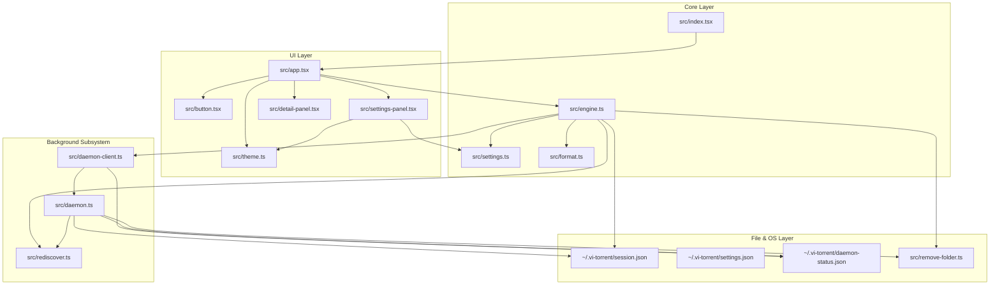

# vitorrent-node: Codebase Navigation & Directory Structure Map

**Workspace Root Path:** repository root  
**Documentation Directory Path:** `docs/`

---

## 1. Directory Tree & File Anatomy

```
vitorrent-node/
├── package.json                         # Project dependencies, scripts, build flags
├── README.md                            # High-level feature overview & usage guide
│
├── docs/                                # Dedicated Project Documentation Directory (26 Files)
│   ├── master_architecture_spec.md      # Master System Architecture & Flow Diagrams
│   ├── navigation_map.md                # Directory Tree, Clickable File Links & Sitemap
│   ├── inter_module_relationships_matrix.md # Inter-Module Relationship Matrix & Data Contracts
│   ├── comprehensive_user_technical_guide.md # Commands, Buttons, Settings, Error Handling & Screen Map
│   ├── working_principles_spec.md       # Core Working Principles & Execution Mechanics
│   ├── exhaustive_code_deconstruction.md # Line-by-Line & Block-by-Block Technical Analysis
│   ├── doc_src_index_tsx.md             # src/index.tsx Spec
│   ├── doc_src_app_tsx.md               # src/app.tsx Spec
│   ├── doc_src_engine_ts.md             # src/engine.ts Spec
│   ├── doc_src_daemon_ts.md             # src/daemon.ts Spec
│   ├── doc_src_daemon_client_ts.md      # src/daemon-client.ts Spec
│   ├── doc_src_settings_panel_tsx.md    # src/settings-panel.tsx Spec
│   ├── doc_src_settings_ts.md           # src/settings.ts Spec
│   ├── doc_src_detail_panel_tsx.md      # src/detail-panel.tsx Spec
│   ├── doc_src_button_tsx.md            # src/button.tsx Spec
│   ├── doc_src_theme_ts.md              # src/theme.ts Spec
│   ├── doc_src_format_ts.md             # src/format.ts Spec
│   ├── doc_src_helpers.md               # Keyboard Utils, Remove Folder, Rediscover, Bun.d.ts Specs
│   ├── doc_src_visuals.md               # Logo wave & pixel avatar Specs
│   ├── doc_src_overlay_tsx.md           # Shared dialog frame & key router Spec
│   ├── doc_src_add_panel_tsx.md         # Add-torrent dialog Spec
│   ├── doc_src_bg_panel_tsx.md          # Background dialog Spec: decide, then Save
│   ├── doc_src_instance_lock_ts.md      # One window per state directory Spec
│   ├── doc_src_webtorrent_platform_ts.md # uTP off POSIX: the fix that unblocked Linux
│   ├── doc_src_register_ts.md           # magnet:/.torrent handler registration Spec
│   ├── doc_src_handoff_ts.md            # Inbox carrying an OS-handed link to the open window
│   ├── doc_multiselect.md                  # Tick several torrents, act on all at once
│   ├── daemon_first_acceptance.md       # Stage 0: what the daemon-first rewrite must satisfy
│   └── doc_tests_suite.md               # 39 Test Suites Comprehensive Spec
│
├── src/                                 # Application Source Code (24 Files)
│   ├── index.tsx                        # Entry point, --conditions=browser guard, signal handlers
│   ├── app.tsx                          # Primary TUI application shell, buttons, table, slash commands
│   ├── engine.ts                        # Core WebTorrent engine wrapper, persistence, background release
│   ├── daemon.ts                        # Detached background process, 1s status writer, HTTP control server
│   ├── daemon-client.ts                 # TUI-side daemon client, status reader, HTTP control proxy
│   ├── settings-panel.tsx               # Settings overlay modal, ladder stepping, live theme preview
│   ├── settings.ts                      # AppSettings data model, load/save JSON, value formatters
│   ├── detail-panel.tsx                 # Per-torrent file list & peer detail modal (/details)
│   ├── add-panel.tsx                    # Add-torrent dialog: inspect, pick files, add or cancel
│   ├── bg-panel.tsx                     # Background dialog: tick, then Save - never acts on click
│   ├── doctor.ts                        # Environment checks: Bun on PATH, dirs, port, long paths
│   ├── instance-lock.ts                 # Pid-file guard: refuses a second window on one state dir
│   ├── webtorrent-platform.ts           # utp:false off Windows - required by EVERY WebTorrent client
│   ├── register.ts                      # --register/--unregister: HKCU magnet: and .torrent handlers
│   ├── handoff.ts                       # Inbox: a browser-launched link reaches the window already open
│   ├── overlay.tsx                      # Shared dialog frame, chrome repaint, key router
│   ├── button.tsx                       # Borderless 1-row button chip, hover fill, 2-click confirm
│   ├── theme.ts                         # 12 color palettes, mutable theme singleton, COMMANDS registry
│   ├── format.ts                        # Byte/speed formatters, multi-chunk progress bar builder
│   ├── logo.ts                          # Per-column logo cell grid + colour wave maths
│   ├── avatar.ts                        # Pixel dinosaur frames, run/hop/blink animation
│   ├── keyboard-utils.ts                # Focused input key interceptor wrapper
│   ├── remove-folder.ts                 # Safe directory remover for destroyed multi-file torrents
│   ├── rediscover.ts                    # Tracker re-announce and DHT lookup trigger on unpause
│   └── bun.d.ts                         # Ambient TypeScript type definitions for Bun runtime
│
└── tests/                               # Comprehensive Test Suite (41 Files)
    ├── README.md                        # Test directory documentation
    ├── _isolate.ts                      # Test isolation helper (vi-torrent_TEST=1, temp dirs)
    ├── test-addfile.ts                  # .torrent bencode validation & HTML rejection tests
    ├── test-all-bugs.tsx                # Regression suite for historical UI & rendering bugs
    ├── test-autocomplete.tsx            # Slash command suggestion box filtering & Tab completion
    ├── test-background-restored.ts      # Background downloader handoff & resume integration tests
    ├── test-background.ts              # Detached daemon process creation & HTTP control tests
    ├── test-badinput.ts                # Magnet URI regex & input validation tests
    ├── test-buttons.tsx                # Button click dispatches & 2-click delete safety arming
    ├── test-details.tsx                 # /details file list, skipping (Space), peer display tests
    ├── test-enter.tsx                   # Enter key execution vs auto-completion exact match tests
    ├── test-ids.ts                      # Stable non-reusable torrent ID allocation tests
    ├── test-mouse.tsx                   # Mouse click row selection & suggestion clicking tests
    ├── test-persistence.ts              # session.json saving & paused re-attachment tests
    ├── test-remove-files.ts             # Directory cleanup for multi-file torrents tests
    ├── test-restore-ui.tsx              # Terminal buffer restoration ANSI code tests
    ├── test-resume.ts                   # Tracker update re-announcement tests
    ├── test-settings.tsx                # Settings modal ladder stepping & live preview tests
    ├── test-table.tsx                   # 10-column table rendering, progress bars, Ratio column tests
    ├── test-themes.tsx                  # /theme command switching & green progress fallback tests
    ├── test-visuals.tsx                 # Logo wave geometry, avatar animation, theme palette tests
    ├── test-rowstate.tsx                # Done/Failed row washes & failure status tests
    ├── test-addpanel.tsx                # Add dialog: preview, file selection, add/cancel tests
    ├── test-bg-panel.tsx                # Background dialog: tick, Save, Cancel discards
    ├── test-bg-button-state.tsx         # BG button disabled only while handing over
    ├── test-bg-toggle-race.ts           # Rapid BG on/off from both buttons keeps the row
    ├── test-header-stale.tsx            # "Reattached N" retires itself when they are gone
    ├── test-instance-lock.ts            # One window per state directory
    ├── test-handoff.ts                  # OS-handed links: the inbox, ordering, stale cutoff
    ├── test-handoff-pickup.tsx          # The running window opens a handed link on its tick
    ├── test-shim.ts                     # The windowless launcher COMPILES under wscript
    ├── test-select-all.ts               # All/None on a running torrent, one save not N
    ├── test-select-all-ui.tsx           # The All/None buttons, driven by real clicks
    ├── test-multiselect.tsx             # Bulk pause/resume/remove on ticked torrents
    ├── test-peer-teardown.ts            # A benign WebTorrent race must not reach the user
    ├── test-layout.tsx                  # Responsive layout at 120x30 down to 45x12
    ├── test-magnet-preview.ts           # A magnet preview can fetch its own metadata
    ├── test-metadata-cache.ts           # Never cache a metadata-less torrent stub
    ├── test-rediscover-throttle.ts      # Forced announces throttled; DHT still asked
    ├── test-restore-magnet-resume.ts    # Resume resolves a magnet restored without metadata
    └── test-selected-progress.ts        # Progress measured over the files you kept
```

---

## 2. Categorized File Index & Clickable File Links

### Core Application & Entry Point
- [`src/index.tsx`](../src/index.tsx): Application bootstrap, `--conditions=browser` re-exec guard, signal handling (`SIGINT`, `SIGTERM`, `SIGHUP`), `@opentui` element registration (`<table />`, `<ascii_font />`, `<input />`, `<select />`).
- [`src/app.tsx`](../src/app.tsx): Main layout component, top button strip, torrent table, slash command runner, terminal cleanup & exit.

### Core Protocol & Engine Engine
- [`src/engine.ts`](../src/engine.ts): WebTorrent client instance wrapper, `session.json` persistence, background release/reclaim management, seed ratio auto-pause, stable display IDs.
- [`src/settings.ts`](../src/settings.ts): `AppSettings` data model, `settings.json` IO, human-readable value descriptions (`describe`).
- [`src/format.ts`](../src/format.ts): Byte scaling (`formatBytes`), speed scaling (`formatSpeed`), multi-chunk progress bar generator (`progressSegments`).
- [`src/logo.ts`](../src/logo.ts): Per-column logo cell grid from the exported `fonts` data, raised-cosine wave, colour blending.
- [`src/avatar.ts`](../src/avatar.ts): Pixel dinosaur sprite frames; run, hop and idle-blink animation at fixed frame height.

### Background Downloader Subsystem
- [`src/daemon.ts`](../src/daemon.ts): Detached background process, 1s `daemon-status.json` writer, HTTP control server on `127.0.0.1`.
- [`src/daemon-client.ts`](../src/daemon-client.ts): TUI-side client, synchronous status reader, HTTP IPC proxy, process spawner (`spawnDetached`).
- [`src/rediscover.ts`](../src/rediscover.ts): Triggers immediate tracker re-announce and DHT lookup upon unpausing.

### UI Components, Overlays & Styling
- [`src/button.tsx`](../src/button.tsx): Compact 1-row button chip, hover state, 2-click delete safety arming.
- [`src/settings-panel.tsx`](../src/settings-panel.tsx): Settings overlay modal, arrow-key stepping ladder, live theme preview.
- [`src/detail-panel.tsx`](../src/detail-panel.tsx): Torrent details overlay (`/details`), per-file inclusion toggling, live peer list visualizer.
- [`src/theme.ts`](../src/theme.ts): 10 color theme palettes (`claude`, `nord`, `gruvbox`, `dracula`, `matrix`, `tokyo`, `catppuccin`, `solarized`, `light`, `darkplus`, `neon`, `mono`), mutable theme singleton, `COMMANDS` registry.

### Utility Modules & Declarations
- [`src/keyboard-utils.ts`](../src/keyboard-utils.ts): Intercepts keystrokes on focused `InputRenderable` instances.
- [`src/remove-folder.ts`](../src/remove-folder.ts): Safe recursive directory cleanup for multi-file torrents.
- [`src/bun.d.ts`](../src/bun.d.ts): Ambient TypeScript declarations for Bun runtime.

---

## 3. Subsystem Dependency & Data Flow Map



---

## 4. Master Specification Cross-Reference Index

For full technical specifications, line-by-line breakdowns, and functional rules of each module, refer to the corresponding documentation files in `docs/`:

- [Master Architecture & Spec Index](master_architecture_spec.md)
- [Inter-Module Relationship Matrix & Dependency Map](inter_module_relationships_matrix.md)
- [Comprehensive User & Technical Operations Guide](comprehensive_user_technical_guide.md)
- [Core Working Principles & Execution Mechanics](working_principles_spec.md)
- [Exhaustive Line-by-Line Code Deconstruction](exhaustive_code_deconstruction.md)
- [src/index.tsx Spec](doc_src_index_tsx.md)
- [src/app.tsx Spec](doc_src_app_tsx.md)
- [src/engine.ts Spec](doc_src_engine_ts.md)
- [src/daemon.ts Spec](doc_src_daemon_ts.md)
- [src/daemon-client.ts Spec](doc_src_daemon_client_ts.md)
- [src/settings-panel.tsx Spec](doc_src_settings_panel_tsx.md)
- [src/settings.ts Spec](doc_src_settings_ts.md)
- [src/detail-panel.tsx Spec](doc_src_detail_panel_tsx.md)
- [src/button.tsx Spec](doc_src_button_tsx.md)
- [src/theme.ts Spec](doc_src_theme_ts.md)
- [src/format.ts Spec](doc_src_format_ts.md)
- [Helper Modules Spec](doc_src_helpers.md)
- [Test Suite Spec](doc_tests_suite.md)
