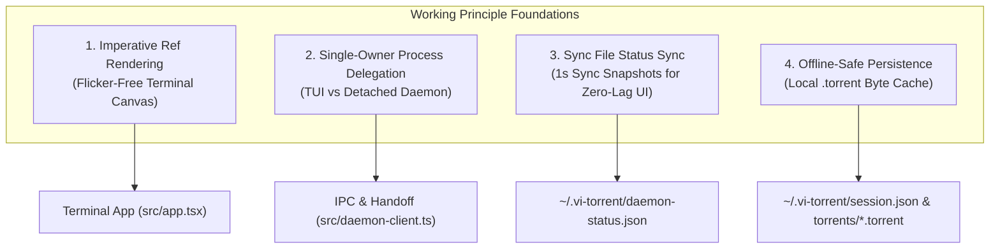
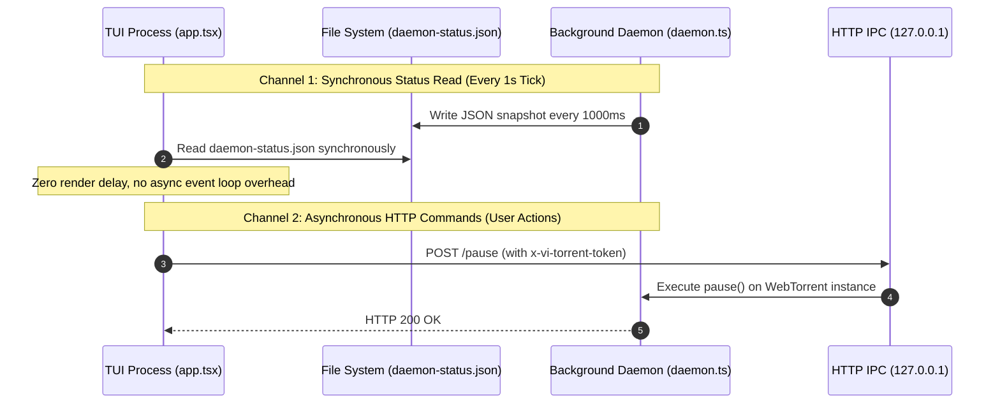

# vitorrent-node: Core Working Principles & Execution Mechanics

This document details the fundamental working principles, architectural invariants, protocol mechanisms, and execution models that govern `vitorrent-node`.

---

## 1. Operating Philosophy & Core Mechanics

`vitorrent-node` is designed as a hybrid Terminal User Interface (TUI) and BitTorrent client engine. Its working principles center on **zero UI flicker**, **single-owner background persistence**, **non-blocking asynchronous protocol execution**, and **guaranteed terminal state restoration**.

---

## 2. Working Principle Breakdown

### Principle 1: Imperative Ref Rendering & OpenTUI Reactivity Model

* **The Problem**: In browser DOM environments, SolidJS compiles JSX into fine-grained reactive DOM element updates. However, in `vitorrent-node`, JSX is compiled using `tsconfig.json`'s `"jsx": "react-jsx"` automatic runtime against `@opentui/solid`'s `jsx-runtime` without `babel-preset-solid`. This means JSX props are evaluated **ONCE** into a plain JavaScript object at component instantiation. There are no reactive getters or property tracking on JSX attributes.
* **The Working Principle**:
  1. JSX elements render structural layout containers once during mount.
  2. All dynamic UI properties (text content, cell styling, background fills, border colors, error lines, menu selections) are attached to element instances via refs (`ref={(el) => (refObject = el)}`).
  3. SolidJS signals trigger `createEffect` blocks that assign updated values **imperatively** directly onto the node properties (`textRef.content = ...`, `boxRef.backgroundColor = ...`).
  4. This eliminates UI layout recalculation lag and guarantees zero visual flicker in the terminal.

---

### Principle 2: Single-Owner Background Handoff & Dual-Writer Protection

* **The Problem**: Running two BitTorrent clients (the TUI process and a background downloader process) targeting the same files on disk will corrupt piece data due to conflicting write locks and race conditions during piece verification.
* **The Working Principle**:
  1. **Strict Single Ownership**: A torrent is owned **EITHER** by the local TUI WebTorrent client **OR** by the detached background daemon (`src/daemon.ts`). It is NEVER owned by both simultaneously.
  2. **Ticking Handoff Pipeline**:
     - When a user ticks `[x] Background` on a torrent, `engine.toggleBackground()` marks the flag in `session.json`.
     - `releaseToBackground()` immediately destroys the local WebTorrent instance (retaining files on disk).
     - The background daemon (`src/daemon.ts`) loads the cached `.torrent` bytes or magnet URI from disk, re-hashes the existing data, and assumes transfer ownership.
  3. **Unticking Reclaim Pipeline**:
     - When a user unticks `[ ] Background`, the TUI instructs the daemon via HTTP POST `/remove` (with `deleteFiles: false`) to drop the torrent.
     - The local TUI client re-adds the torrent in `paused` state. WebTorrent verifies the existing data on disk and resumes cleanly.

---

### Principle 3: Dual-Channel IPC (Sync Status Reader + Async HTTP Control)

* **The Problem**: Making asynchronous IPC calls over network sockets or RPC on every 1-second UI refresh tick introduces latency spikes and render loop lag, causing terminal input stutter.
* **The Working Principle**:
  `vitorrent-node` decouples status reading from command control using two distinct communication channels:

---

### Principle 4: Session Persistence & Offline-Safe Restoration

* **The Working Principle**:
  1. **Atomic Session Index**: Whenever a torrent is added, modified, or completed, `engine.saveSession()` writes the array of active metadata to `~/.vi-torrent/session.json`.
  2. **Local Metadata Byte Caching**: Raw `.torrent` file bytes are saved to `~/.vi-torrent/torrents/<infoHash>.torrent`. On app relaunch, torrents re-added from local bencoded file buffers immediately verify existing piece hashes on disk without requiring network calls to fetch metadata from peers.
  3. **Restored in Paused State**: On launch, `restore()` re-attaches all torrents in `paused` state. BitTorrent swarms are not joined until the user explicitly clicks `Resume`.
  4. **Unpause Peer Rediscovery**: WebTorrent discards peers discovered while paused. Upon resuming a torrent, `src/rediscover.ts` triggers `discovery.tracker.update()` and `discovery.dht.lookup()` to re-announce the client to trackers immediately.

---

### Principle 5: Keystroke Interception & Focus Scope Management

* **The Problem**: In `@opentui/core`, focused `InputRenderable` instances capture all keypresses in their internal `handleKeyPress` method, preventing global key listeners from receiving shortcuts (e.g. `Ctrl+C`, `Up`/`Down` table navigation, modal `Escape`).
* **The Working Principle**:
  1. `src/keyboard-utils.ts` (`interceptKeyPress`) overrides `inputRef.handleKeyPress` directly on the input instance.
  2. Incoming keys are evaluated against a priority chain:
     - **Active Overlay Modals**: If `SettingsPanel` or `DetailPanel` is open, modal key handlers receive the key first.
     - **Global Shortcuts**: `Ctrl+C` triggers graceful shutdown.
     - **Table Navigation**: `Up`/`Down` arrows navigate table rows when no autocomplete suggestions are active.
     - **Input Fallthrough**: If no shortcut claims the key, execution falls through to the input's original typing logic.

---

### Principle 6: Terminal Screen Buffer Restitution

* **The Problem**: Terminals running TUI applications switch to an alternate screen buffer (`\x1b[?1049h`). Abrupt process termination leaves the terminal locked in raw mode with scrollback buffer corrupted.
* **The Working Principle**:
  1. `shutdown()` halts the renderer loop (`renderer.stop()`) first to prevent pending render frames from overwriting cleanup commands.
  2. Explicit ANSI escape sequences are written directly to `process.stdout`:
     - `\x1b[?1049l`: Exit alternate screen buffer.
     - `\x1b[?25h`: Show mouse cursor.
     - `\x1b[?1000l\x1b[?1002l\x1b[?1003l\x1b[?1006l`: Disable mouse tracking protocols.
     - `\x1b[0m`: Reset text attributes.
  3. The process yields execution (`setTimeout(..., 400)`) to allow stdout buffers to flush before calling `process.exit(0)`.

---

## 3. Summary of Working Principles Matrix

| System Subsystem | Working Principle | Key Implementation Mechanism |
| :--- | :--- | :--- |
| **UI Engine** | Imperative Ref Binding | Signal `createEffect` assigning directly to `ref.content` & `boxRef.backgroundColor` |
| **Process Model** | Self-Relaunch Guard | `Bun.resolveSync` checking `solid-js` for `"server"`, respawning with `--conditions=browser` |
| **Background Downloader** | Single-Owner Process Handoff | Local destroy + detached daemon re-hash; synchronous status file reads |
| **Networking & IPC** | Dual-Channel IPC | 1s `daemon-status.json` sync reader + `127.0.0.1` HTTP POST token-authenticated server |
| **BitTorrent Swarm** | Re-announce on Unpause | `rediscover()` calling `tracker.update()` & `dht.lookup()` to bypass paused peer drop |
| **Data Safety** | 2-Click Destructive Confirm | `armedDeleteKey` signal holding the joined ids of the whole target set, so it names the count and disarms whenever the selection changes |
| **Filesystem Safety** | Directory Containment & Verification | `removeTorrentFolder()` checking `holdsNoFiles()` & path traversal prevention (`..`) |
| **Terminal Exit** | Explicit ANSI Buffer Restitution | Direct `process.stdout.write()` of ANSI reset & alternate buffer exit sequences |
